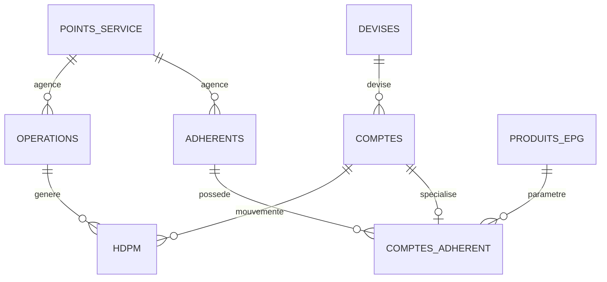
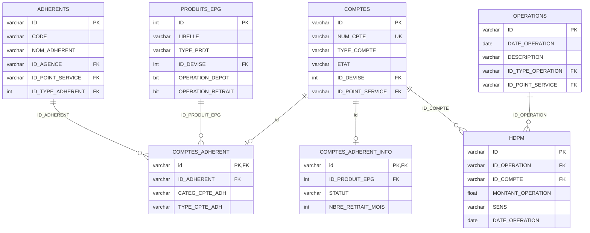
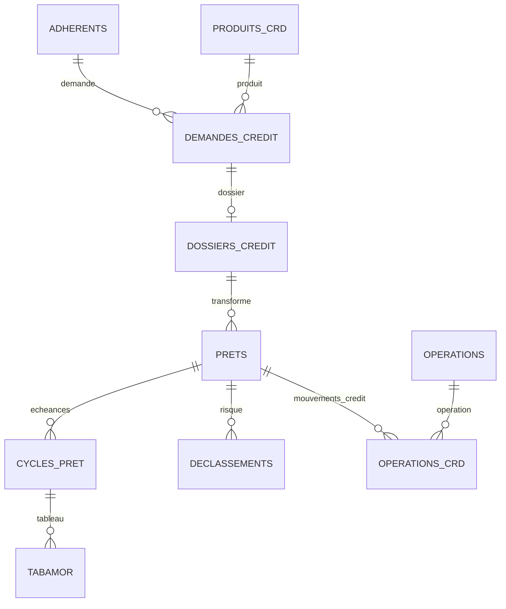

# Modelisation simplifiee - BB_VISION_PRO

Ce document resume la structure metier principale observee dans `BB_VISION_PRO.sql`.
Les fichiers `procedure_controle_interne.sql` et `requetes.sql` ne creent pas de tables ni de cles etrangeres.

## Vue Globale

## Cycle Epargne

## Cycle Credit

## Relations Principales

| Table enfant | Colonne | Table parent | Role metier |
|---|---|---|---|
| `ADHERENTS` | `ID_AGENCE` | `POINTS_SERVICE.ID` | agence de rattachement du client |
| `ADHERENTS` | `ID_POINT_SERVICE` | `POINTS_SERVICE.ID` | point de service lie au client |
| `ADHERENTS` | `ID_TYPE_ADHERENT` | `TYPES_ADHERENT.ID` | type/categorie client |
| `INDIVIDUS` | `ID` | `ADHERENTS.ID` | details personne physique |
| `INDIVIDUS` | `ID_PERSONNE` | `PERSONNES.ID` | identite civile |
| `GROUPES` | `ID` | `ADHERENTS.ID` | details groupe |
| `ENTREPRISES` | `ID` | `ADHERENTS.ID` | details entreprise |
| `IMFS` | `ID` | `ADHERENTS.ID` | details IMF |
| `COMPTES_ADHERENT` | `ID_ADHERENT` | `ADHERENTS.ID` | lien client-compte |
| `COMPTES_ADHERENT` | `id` | `COMPTES.ID` | compte bancaire/epargne du client |
| `COMPTES_ADHERENT` | `ID_PRODUIT_EPG` | `PRODUITS_EPG.ID` | produit epargne applique |
| `COMPTES_ADHERENT_INFO` | `id` | `COMPTES.ID` | parametres complementaires du compte |
| `COMPTES` | `ID_DEVISE` | `DEVISES.ID` | devise du compte |
| `COMPTES` | `ID_POINT_SERVICE` | `POINTS_SERVICE.ID` | agence du compte |
| `OPERATIONS` | `ID_TYPE_OPERATION` | `TYPES_OPERATION.ID` | nature de l'operation |
| `OPERATIONS` | `ID_POINT_SERVICE` | `POINTS_SERVICE.ID` | agence de saisie |
| `OPERATIONS` | `ID_UTILISATEUR` | `UTILISATEURS.id` | utilisateur createur |
| `HDPM` | `ID_OPERATION` | `OPERATIONS.ID` | operation mere |
| `HDPM` | `ID_COMPTE` | `COMPTES.ID` | compte mouvemente |
| `HDPM` | `ID_DEVISE` | `DEVISES.ID` | devise du mouvement |
| `HDPM` | `ID_TYPE_OPERATION` | `TYPES_OPERATION.ID` | type du mouvement |
| `DEMANDES_CREDIT` | `ID_ADHERENT` | `ADHERENTS.ID` | client demandeur |
| `DEMANDES_CREDIT` | `ID_PRODUIT_CREDIT` | `PRODUITS_CRD.ID` | produit credit demande |
| `DOSSIERS_CREDIT` | `ID_DEMANDE` | `DEMANDES_CREDIT.ID` | dossier issu de la demande |
| `PRETS` | `ID_DOSSIER_CREDIT` | `DOSSIERS_CREDIT.ID` | pret accorde |
| `PRETS` | `ID_COMPTE_CREDIT` | `COMPTES.ID` | compte credit |
| `PRETS` | `ID_COMPTE_EPARGNE` | `COMPTES.ID` | compte epargne associe |
| `CYCLES_PRET` | `ID_PRET` | `PRETS.ID` | cycle/echeance du pret |

## Cardinalites Principales

Les cardinalites ci-dessous sont deduites des cles etrangeres et des tables de liaison du dump SQL.

| Relation | Cardinalite | Lecture metier |
|---|---:|---|
| `POINTS_SERVICE` -> `ADHERENTS` | 1 -> 0..N | une agence peut avoir plusieurs adherents |
| `TYPES_ADHERENT` -> `ADHERENTS` | 1 -> 0..N | un type d'adherent classe plusieurs adherents |
| `ADHERENTS` -> `INDIVIDUS` | 1 -> 0..1 | un adherent physique a une fiche individu |
| `ADHERENTS` -> `GROUPES` | 1 -> 0..1 | un adherent groupe a une fiche groupe |
| `ADHERENTS` -> `ENTREPRISES` | 1 -> 0..1 | un adherent entreprise a une fiche entreprise |
| `ADHERENTS` -> `IMFS` | 1 -> 0..1 | un adherent IMF a une fiche IMF |
| `ADHERENTS` -> `COMPTES_ADHERENT` | 1 -> 0..N | un adherent peut posseder plusieurs comptes |
| `COMPTES` -> `COMPTES_ADHERENT` | 1 -> 0..1 | un compte peut etre specialise comme compte adherent |
| `PRODUITS_EPG` -> `COMPTES_ADHERENT` | 1 -> 0..N | un produit epargne peut etre utilise par plusieurs comptes |
| `COMPTES` -> `COMPTES_ADHERENT_INFO` | 1 -> 0..1 | un compte peut avoir des parametres epargne complementaires |
| `COMPTES` -> `HDPM` | 1 -> 0..N | un compte recoit plusieurs mouvements |
| `OPERATIONS` -> `HDPM` | 1 -> 0..N | une operation genere une ou plusieurs lignes de mouvement |
| `TYPES_OPERATION` -> `OPERATIONS` | 1 -> 0..N | un type operation est reutilise par plusieurs operations |
| `DEVISES` -> `COMPTES` | 1 -> 0..N | une devise est rattachee a plusieurs comptes |
| `DEVISES` -> `HDPM` | 1 -> 0..N | une devise est rattachee a plusieurs mouvements |
| `ADHERENTS` -> `DEMANDES_CREDIT` | 1 -> 0..N | un client peut faire plusieurs demandes de credit |
| `PRODUITS_CRD` -> `DEMANDES_CREDIT` | 1 -> 0..N | un produit credit peut etre demande plusieurs fois |
| `DEMANDES_CREDIT` -> `DOSSIERS_CREDIT` | 1 -> 0..1 | une demande peut donner lieu a un dossier |
| `DOSSIERS_CREDIT` -> `PRETS` | 1 -> 0..N | un dossier peut produire un ou plusieurs prets/cycles de financement |
| `PRETS` -> `CYCLES_PRET` | 1 -> 0..N | un pret peut avoir plusieurs cycles |
| `CYCLES_PRET` -> `TABAMOR` | 1 -> 0..N | un cycle peut avoir plusieurs lignes d'amortissement |
| `PRETS` -> `DECLASSEMENTS` | 1 -> 0..N | un pret peut avoir plusieurs declassements/etats de risque |
| `COMPTES` -> `CLOTURE_COMPTE` | 1 -> 0..N | un compte peut avoir des evenements de cloture/reouverture |
| `ADHERENTS` -> `SIGNATAIRES_ADH` | 1 -> 0..N | un adherent peut avoir plusieurs signataires |
| `COMPTES` -> `SIGNATAIRES_ADH` | 1 -> 0..N | un compte peut avoir plusieurs signataires |

## Regles De Gestion Deduites

### Identification Et Referentiel

1. Chaque table principale possede une cle primaire : souvent `ID`, parfois `id`.
2. `COMPTES.NUM_CPTE` est unique : deux comptes ne doivent pas avoir le meme numero.
3. `ADHERENTS.CODE` est unique : deux adherents ne doivent pas partager le meme code client.
4. `DEVISES.LIBELLE` est unique : une devise ne doit pas etre dupliquee par libelle.
5. `PRODUITS_EPG` et `PRODUITS_CRD` sont des tables de parametrage : elles definissent les produits disponibles avant l'ouverture d'un compte ou l'octroi d'un credit.

### Clients Et Comptes

1. `ADHERENTS` est la table centrale du client.
2. La categorie de l'adherent determine la table de detail :
   `INDIVIDUS` pour personne physique, `GROUPES` pour groupe, `ENTREPRISES` pour personne morale, `IMFS` pour institution.
3. Un compte client est d'abord un enregistrement dans `COMPTES`, puis il devient un compte adherent via `COMPTES_ADHERENT`.
4. Le lien `COMPTES_ADHERENT.id -> COMPTES.ID` montre une relation 1 a 1 pour la specialisation du compte client.
5. Le lien `COMPTES_ADHERENT.ID_ADHERENT -> ADHERENTS.ID` montre qu'un adherent peut avoir plusieurs comptes.
6. `COMPTES_ADHERENT_INFO` stocke les regles complementaires du compte : produit epargne, statut, nombre de retraits par mois, nombre d'operations par jour.

### Epargne, Depots Et Retraits

1. Les depots/retraits ne doivent pas etre analyses uniquement dans `OPERATIONS`.
2. `OPERATIONS` est l'entete de l'operation : date, description, utilisateur, agence, type operation.
3. `HDPM` est le detail comptable : compte touche, montant, sens, devise, date et reference operation.
4. Une operation peut generer plusieurs lignes dans `HDPM`, par exemple debit d'un compte et credit d'un autre compte.
5. Le champ `SENS` dans `HDPM` est essentiel pour distinguer debit/credit.
6. Le montant utile pour les analyses est dans `HDPM.MONTANT_OPERATION`.
7. Les vues `HDPM_VIEW`, `HDPM_API_VIEW` et `HDPM_MULTI_DEVISE_VIEW` servent a consolider les mouvements internes, API et multidevises.
8. Les fonctions `verifier_compte`, `verifier_compte_by_id_devise` filtrent les comptes operationnels selon le numero de compte et, pour la seconde, la devise.
9. La fonction `releve` calcule le solde initial et le solde progressif d'un compte sur une periode a partir de `HDPM_VIEW`.

### Produits Epargne

1. `PRODUITS_EPG.ID_DEVISE` impose qu'un produit epargne soit rattache a une devise.
2. `PRODUITS_EPG.OPERATION_DEPOT` et `PRODUITS_EPG.OPERATION_RETRAIT` indiquent si le produit autorise depot et retrait.
3. Les champs comme `NBRE_RETRAIT_MOIS`, `RETRAIT_MAX`, `TAUX_INTERET_CREDITEUR`, `FRAIS_OUVERTURE_COMPTE`, `FRAIS_CLOTURE_COMPTE` portent les limites et frais du produit.
4. Un compte adherent pointe vers un produit epargne via `ID_PRODUIT_EPG`.

### Operations Et Audit

1. Chaque operation est rattachee a un type operation via `ID_TYPE_OPERATION`.
2. Chaque operation peut etre rattachee a un utilisateur createur et a un utilisateur validateur.
3. Une operation peut etre annulee : champs `ANNULE`, `ID_OPERATION_ANNULE`, `ID_OPERATION_MERE`.
4. Les champs `DATE_SAISIE`, `DATE_VALIDATION`, `DATE_VALIDE` permettent de suivre le cycle de saisie et validation.
5. Les operations API sont stockees dans `OPERATIONS_API`, avec `CODE` et `NUM_TRANSACTION` uniques.

### Credit

1. Une demande de credit appartient a un adherent et a un produit credit.
2. Une demande peut etre transformee en dossier credit.
3. Un dossier credit porte les conditions : montant sollicite, montant accorde, periodicite, nombre d'echeances, taux, objet du financement et gestionnaire.
4. Un pret est rattache a un dossier credit et a plusieurs comptes comptables : compte credit, compte epargne, compte remboursement, compte sain.
5. Un pret peut avoir plusieurs cycles dans `CYCLES_PRET`.
6. Le tableau d'amortissement est porte par `TABAMOR`, rattache au cycle/pret.
7. Les declassements suivent le risque du pret : compte credit, compte souffrant, compte provision, retard, provision, impaye.

### Cloture Et Signataires

1. `CLOTURE_COMPTE` garde les evenements de cloture/reouverture d'un compte.
2. Une cloture peut avoir un motif via `MOTIFS_CLOTURE`.
3. `SIGNATAIRES_ADH` relie un adherent, un compte et une personne autorisee a signer.
4. Un compte peut donc avoir plusieurs signataires selon les mandats et niveaux d'autorisation.

## Lecture Fonctionnelle

1. Un client est cree dans `ADHERENTS`.
2. Selon sa categorie, ses details sont dans `INDIVIDUS`, `GROUPES`, `ENTREPRISES` ou `IMFS`.
3. Un compte general est cree dans `COMPTES`.
4. Si c'est un compte client, il est rattache via `COMPTES_ADHERENT`.
5. Le produit epargne vient de `PRODUITS_EPG`.
6. Une operation est enregistree dans `OPERATIONS`.
7. Les lignes comptables/mouvements sont dans `HDPM`.
8. `HDPM_VIEW` et `HDPM_API_VIEW` consolident les mouvements internes et API.

## Point Important

Pour les analyses depots/retraits, la table la plus utile n'est pas seulement `OPERATIONS`.
Il faut partir de `HDPM_VIEW` ou `HDPM_API_VIEW`, car ces vues donnent les mouvements par compte avec `ID_COMPTE`, `SENS`, `MONTANT_OPERATION`, `DATE_OPERATION`, `ID_TYPE_OPERATION` et `ID_OPERATION`.
