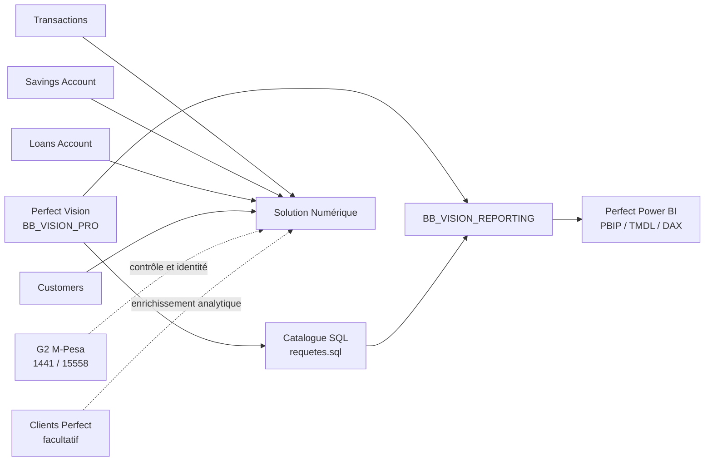

# Architecture globale

La documentation couvre trois chaînes de valeur complémentaires.

## Responsabilités

| Sujet | Perfect Vision | Perfect Power BI | Solution Numérique |
|---|---|---|---|
| Données métier microfinance | Source opérationnelle historique | Consommées via reporting | Hors périmètre principal |
| Reporting décisionnel | Fournit les règles et données | Produit les KPI et visuels | Peut fournir une lecture digitale séparée |
| Transactions numériques | Peut servir au rapprochement selon disponibilité | Non source principale | Source principale via Transactions |
| G2 M-Pesa | Contrôle éventuel | Généralement non pilotant | Contrôle secondaire et enrichissement d'identité |
| Devises | Séparées | Séparées | Séparées |

## Règle de non-confusion

Un même libellé de KPI ne signifie pas forcément le même calcul. Par exemple, un indicateur de crédit peut exister dans Perfect Vision, dans Power BI et dans la Solution Numérique, mais la source, le grain et les champs disponibles peuvent différer.
