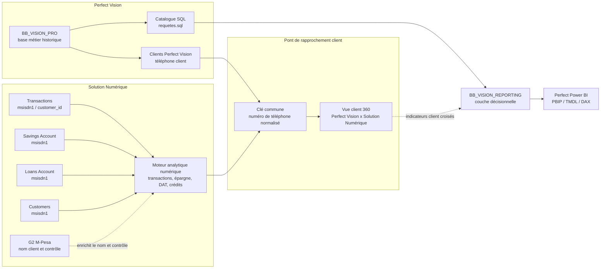

# Architecture globale

La documentation couvre trois chaînes de valeur complémentaires.

L'objectif cible est de relier progressivement Perfect Vision et la Solution Numérique par le **numéro de téléphone normalisé**. Cette clé permet de rapprocher un client Perfect Vision avec ses activités numériques : transactions, compte ouvert, DAT, crédit digital, activité G2 de contrôle et indicateurs statistiques.

Le rapprochement par téléphone ne transforme pas G2 en source financière. G2 reste une preuve de contrôle et d'identité ; les montants de la Solution Numérique restent calculés depuis les fichiers numériques principaux.

## Responsabilités

| Sujet | Perfect Vision | Perfect Power BI | Solution Numérique |
|---|---|---|---|
| Données métier microfinance | Source opérationnelle historique | Consommées via reporting | Hors périmètre principal |
| Reporting décisionnel | Fournit les règles et données | Produit les KPI et visuels | Peut fournir une lecture digitale séparée |
| Transactions numériques | Peut servir au rapprochement selon disponibilité | Non source principale | Source principale via Transactions |
| G2 M-Pesa | Contrôle éventuel | Généralement non pilotant | Contrôle secondaire et enrichissement d'identité |
| Pont client | Fournit l'identité client et le téléphone de référence | Peut exploiter la vue client croisée | Utilise `msisdn1` / téléphone normalisé pour relier l'activité numérique au client Perfect Vision |
| Devises | Séparées | Séparées | Séparées |

## Règle de non-confusion

Un même libellé de KPI ne signifie pas forcément le même calcul. Par exemple, un indicateur de crédit peut exister dans Perfect Vision, dans Power BI et dans la Solution Numérique, mais la source, le grain et les champs disponibles peuvent différer.
