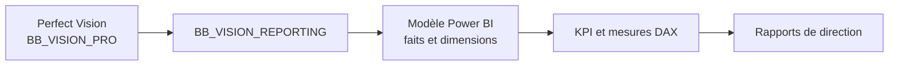

# Formation Perfect Power BI

## Objectif du module

Perfect Power BI sert à produire un reporting décisionnel lisible par la direction. Cette formation aide à comprendre le rôle de la couche `BB_VISION_REPORTING`, des KPI, du modèle de données et des règles de lecture.

## 1. Chaîne de reporting

## 2. Pourquoi une couche reporting 

Une base opérationnelle est faite pour travailler. Une couche reporting est faite pour analyser.

`BB_VISION_REPORTING` permet de :

- préparer les faits et dimensions ;
- stabiliser les définitions KPI ;
- éviter de recalculer les mêmes indicateurs partout ;
- faciliter la lecture dans Power BI.

## 3. Bonnes pratiques de lecture

| Sujet | Règle |
|---|---|
| Devise | CDF et USD restent séparés |
| Période | Toujours vérifier la date de début et la date de fin |
| KPI | Lire la définition avant de comparer |
| Graphique | Vérifier la source et le périmètre |
| Écart | Chercher la cause avant de conclure |

## 4. Lien avec les formations métier

Power BI ne remplace pas la compréhension métier. Il la rend visible. Avant de lire un tableau Power BI, l'utilisateur doit comprendre :

- la source ;
- le grain ;
- la période ;
- la devise ;
- le filtre appliqué ;
- la définition exacte du KPI.

## Questions de contrôle

1. Pourquoi ne pas connecter Power BI directement à toutes les tables opérationnelles sans modèle 
2. Qu'est-ce qu'une mesure DAX 
3. Pourquoi faut-il vérifier la devise avant de lire un montant 
4. Quelle différence y a-t-il entre un fait et une dimension 

