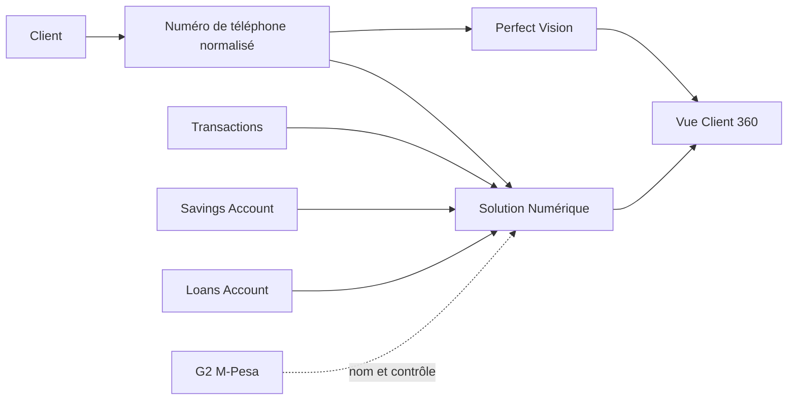

# Formation Solution Numérique

## Objectif du module

À la fin de cette formation, l'utilisateur doit pouvoir :

- identifier les fichiers nécessaires à l'analyse numérique ;
- comprendre comment une transaction, une épargne, un DAT ou un crédit génère des lignes ;
- lire un extrait client comme un relevé bancaire ;
- comprendre pourquoi le numéro de téléphone sert de pont avec Perfect Vision ;
- utiliser les onglets `Clients`, `Épargnes`, `Crédits`, `Statistiques` et `Solution Numérique / M-Pesa` sans surcharger l'application.

## 1. Comprendre les sources

| Source | Rôle pédagogique | Point d'attention |
|---|---|---|
| `Transactions` | Journal principal des mouvements numériques | Source des dépôts, retraits, remboursements et activité dans le temps |
| `Savings Account` | Situation des comptes ouverts et comptes bloqués / DAT | Source maître des soldes d'épargne et échéances DAT |
| `Loans Account` | Portefeuille des crédits numériques | Source des crédits accordés, encours, statuts et échéances |
| `Customers` | Référentiel client numérique | Source des téléphones et dates de création client |
| `G2 M-Pesa` | Contrôle et enrichissement d'identité | Ne pilote pas les montants |
| `Clients Perfect` | Croisement facultatif avec Perfect Vision | Sert au rapprochement analytique par téléphone |

## 2. Circuit d'information simplifié

La clé de rapprochement à retenir est le **numéro de téléphone normalisé**. Elle permet d'associer progressivement l'identité Perfect Vision à l'activité numérique observée.

## 3. Lecture par onglet

| Onglet | Ce qu'on apprend | Bon réflexe |
|---|---|---|
| `Importation et contrôle` | Qualité des fichiers chargés | Corriger les colonnes ou anomalies avant l'analyse |
| `Extraits clients` | Relevé bancaire du compte ouvert, DAT et remboursements | Lire les mouvements sans mélanger crédit et épargne |
| `Finance et comptabilité` | Balance observée, journaux, dépôts et retraits | Toujours lire par devise |
| `Clients` | Client 360, activation, produits détenus et opportunités | Cliquer sur `Actualiser les clients` avant lecture |
| `Épargnes` | Comptes ouverts, DAT, échéances, concentration | Distinguer compte ouvert et compte bloqué |
| `Crédits` | Production, remboursements, encours, risques | Distinguer crédit accordé, remboursement observé et encours |
| `Statistiques` | Tendances, comparaisons et indicateurs de direction | Ne pas mélanger CDF et USD |
| `Projections` | Prévisions prudentes à partir de l'historique | Lire les limites du modèle avant décision |

## 4. Extrait client

L'extrait client doit être lu comme un relevé bancaire professionnel :

- le détail transactionnel montre les mouvements qui touchent le compte ouvert ;
- les DAT en cours sont présentés dans leur bloc dédié ;
- les remboursements observés sont séparés ;
- le format minimal garde uniquement l'essentiel ;
- le format global ajoute les blocs de contrôle utiles.

## 5. Performance et bonne utilisation

Les analyses lourdes ne doivent pas se lancer à chaque changement de filtre. La bonne pratique est :

1. choisir la période et les paramètres ;
2. cliquer sur `Actualiser` ;
3. lire les KPI et tableaux à l'écran ;
4. préparer l'Excel seulement si un retraitement ou un partage est nécessaire.

## Questions de contrôle

1. Pourquoi G2 M-Pesa ne doit-il pas calculer les montants 
2. Quel fichier permet de connaître les DAT et comptes ouverts 
3. Pourquoi le numéro de téléphone est-il important dans le lien avec Perfect Vision 
4. Pourquoi faut-il éviter d'additionner CDF et USD 
5. Quelle différence y a-t-il entre un compte ouvert et un compte bloqué 

