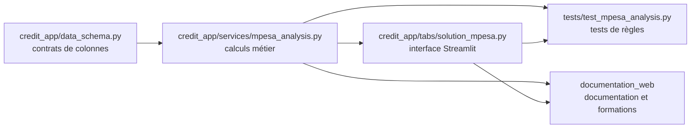

# Technique pour informaticiens

Cette page conserve la lecture technique nécessaire aux informaticiens. Elle complète les formations métier sans les remplacer.

## Objectif

Un informaticien doit pouvoir comprendre :

- où se trouvent les calculs ;
- quelles sources alimentent les analyses ;
- quels contrats de colonnes sont attendus ;
- quels tests protègent les règles métier ;
- quelles limites techniques doivent être surveillées ;
- comment maintenir la documentation et le site.

## Carte technique du projet

| Élément | Rôle |
|---|---|
| `controle_interne.py` | Point d'entrée principal de l'application Streamlit |
| `credit_app/tabs/solution_mpesa.py` | Interface de la Solution Numérique : onglets, filtres, exports, affichage |
| `credit_app/services/mpesa_analysis.py` | Calculs métier : transactions, clients, épargne, DAT, crédits, statistiques |
| `credit_app/data_schema.py` | Contrats et colonnes attendues |
| `data/vision/requetes.sql` | Catalogue SQL Perfect Vision et indicateurs prioritaires |
| `documentation_web/` | Source Markdown de la documentation et des formations |
| `site/` | Site HTML généré par MkDocs |
| Référentiel technique Solution Numérique | Règles métier et techniques de la Solution Numérique |
| Référentiel technique Perfect Vision | Règles métier et techniques Perfect Vision |
| Référentiel technique Perfect Power BI | Règles Power BI, modèle, DAX et validation |
| `tests/` | Tests automatisés de non-régression |

## Solution Numérique : séparation interface / calculs

La règle de maintenance est simple : l'interface affiche, le service calcule, les tests protègent, la documentation explique.

## Colonnes techniques et noms français

La Solution Numérique reçoit souvent des colonnes anglaises, par exemple :

| Colonne technique | Nom métier à expliquer |
|---|---|
| `customer_id` | identifiant client |
| `msisdn1` | numéro de téléphone |
| `currency_code` | devise |
| `created_at` | date de création |
| `reference_id` | référence métier |
| `ref_no` | référence de reçu ou opération |
| `dr` | débit |
| `cr` | crédit |
| `bal_before` | solde avant |
| `bal_after` | solde après |
| `loan_balance` | solde du crédit |
| `savings_id` | identifiant du compte d'épargne |

Les noms français facilitent la lecture métier, mais les noms techniques doivent rester documentés pour éviter de casser les calculs.

## Performance Streamlit

Les informaticiens doivent surveiller :

- les gros fichiers Excel ;
- les recalculs dans les onglets cachés ;
- les exports générés trop tôt ;
- les caches non bornés ;
- les tableaux trop larges ;
- les graphiques lourds ;
- les conversions de colonnes incompatibles avec Arrow.

Règle actuelle : l'analyse en ligne est prioritaire, puis les exports Excel volumineux sont préparés uniquement à la demande avec le parcours `Préparer` puis `Télécharger`.

## Tests à privilégier

| Besoin | Test ou famille de tests |
|---|---|
| Règles Solution Numérique | `tests/test_mpesa_analysis.py` |
| Téléversements et colonnes attendues | `tests/test_solution_mpesa_uploads.py` |
| Format français des dates | `tests/test_streamlit_date_format.py` |
| Graphiques et rendu visuel | `tests/test_ui_charts.py` |
| Encodage texte | `tests/test_text_encoding.py` |

## Documentation technique

Quand une règle change dans le code, vérifier au minimum :

1. le référentiel technique concerné ;
2. la page `documentation_web` correspondante ;
3. la FAQ si la question est récurrente ;
4. le changelog si le changement influence l'usage ;
5. le site généré avec `mkdocs build`.

## À retenir

La formation doit rendre le métier compréhensible, mais la documentation technique doit rester assez précise pour qu'un informaticien puisse maintenir le projet sans deviner.
