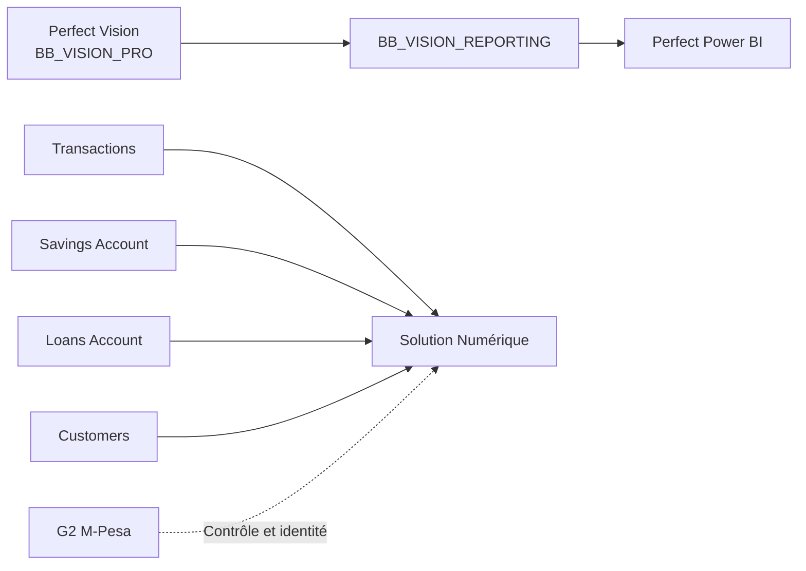

<section class="bb-hero">
  
Microfinance Bisou Bisou S.A

  <h1>Documentation Web des solutions Data</h1>
  

    Un point d'entrée unique pour comprendre Perfect Vision, Perfect Power BI
    et la Solution Numérique : sources, règles métier, KPI, contrôles, exports,
    limites et responsabilités.
  

  

    <a href="perfect_vision/index.html" class="bb-button">Perfect Vision</a>
    <a href="perfect_power_bi/index.html" class="bb-button bb-button--light">Perfect Power BI</a>
    <a href="solution_numerique/index.html" class="bb-button bb-button--green">Solution Numérique</a>
  

</section>

<section class="bb-section">
  <h2>Trois domaines, un seul site</h2>
  

    <article class="bb-card">
      Base métier
      <h3>Perfect Vision</h3>
      

        Documentation du socle SQL, des cycles de contrôle, des requêtes
        prioritaires et du tableau de bord Streamlit.
      

      <a href="perfect_vision/index.html">Ouvrir la documentation →</a>
    </article>
    <article class="bb-card">
      Décisionnel
      <h3>Perfect Power BI</h3>
      

        Documentation de BB_VISION_REPORTING, du modèle en étoile, des pages
        Power BI, des mesures DAX et des validations.
      

      <a href="perfect_power_bi/index.html">Ouvrir la documentation →</a>
    </article>
    <article class="bb-card">
      Digital
      <h3>Solution Numérique</h3>
      

        Documentation des imports, extraits clients, DAT, crédits, statistiques,
        projections, balances et rapprochements G2.
      

      <a href="solution_numerique/index.html">Ouvrir la documentation →</a>
    </article>
  

</section>

<section class="bb-section bb-section--soft">
  <h2>Architecture simplifiée</h2>

</section>

<section class="bb-section">
  <h2>Règles de lecture essentielles</h2>
  

    
<strong>Devises séparées</strong> CDF et USD ne sont jamais additionnés sans conversion officielle documentée.

    
<strong>G2 non pilotant</strong> G2 enrichit l'identité et contrôle les écritures, sans piloter les montants.

    
<strong>Traçabilité</strong> Chaque KPI doit pouvoir être relié à sa source, son grain, sa période et sa devise.

    
<strong>Confidentialité</strong> Aucune donnée client réelle ne doit être publiée dans la documentation web.

  

</section>

<section class="bb-section">
  <h2>Sources documentaires utilisées</h2>
  <table>
    <thead>
      <tr>
        <th>Source</th>
        <th>Utilisation</th>
      </tr>
    </thead>
    <tbody>
      <tr><td><code>skills/perfect-vision</code></td><td>Règles Perfect Vision et cycles de contrôle</td></tr>
      <tr><td><code>skills/perfect-power-bi</code></td><td>Architecture Power BI, DAX, validation et déploiement</td></tr>
      <tr><td><code>skills/solution-mpesa</code></td><td>Règles Solution Numérique, contrats, exports et KPI</td></tr>
      <tr><td><code>data/modelisation/requetes.sql</code></td><td>Catalogue SQL des requêtes métier</td></tr>
      <tr><td><code>data/kpi_perfect</code></td><td>PBIP, TMDL, reporting SQL et documentation KPI</td></tr>
      <tr><td><code>credit_app/services/mpesa_analysis.py</code></td><td>Calculs métier de la Solution Numérique</td></tr>
    </tbody>
  </table>
</section>
