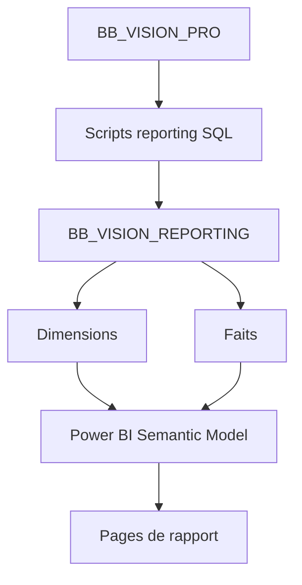

# Architecture reporting Power BI

## Chaîne cible



## Scripts SQL observés

| Script | Rôle |
|---|---|
| `01_create_database_and_schemas.sql` | Création de la base/schémas reporting |
| `02_create_dimensions.sql` | Dimensions conformes |
| `03_create_facts.sql` | Tables de faits |
| `04_create_etl_control.sql` | Suivi ETL |
| `05_load_dimensions.sql` | Chargement dimensions |
| `06_create_powerbi_views.sql` | Vues consommables par Power BI |
| `07_quality_checks.sql` | Contrôles qualité |
| `08_create_indexes.sql` | Indexation |
| `09` à `19` | Chargement et validation faits clients, conformité, crédit, épargne |
| `20_health_check_reporting.sql` | Santé de la couche reporting |

## Règle de traçabilité

Une mesure Power BI doit pouvoir être reliée à :

```text
Mesure DAX → table reporting → règle SQL → source Perfect Vision
```
