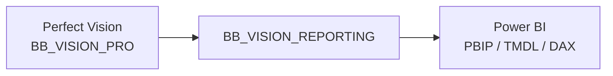

# Perfect Power BI

Perfect Power BI est la couche décisionnelle destinée au reporting, aux KPI et aux tableaux de bord.

Elle dépend fonctionnellement de Perfect Vision :

## Sources documentaires

- `skills/perfect-power-bi/SKILL.md`
- `skills/perfect-power-bi/references/architecture-and-connectivity.md`
- `skills/perfect-power-bi/references/semantic-model-and-pages.md`
- `skills/perfect-power-bi/references/validation-and-deployment.md`
- `data/kpi_perfect/reporting_sql`
- `data/kpi_perfect/power-bi`
- `documentation_web/perfect_power_bi/catalogue_kpi.md`
- `documentation_web/perfect_power_bi/data_gaps.md`
- `documentation_web/perfect_power_bi/resultats_validation.md`
- `documentation_web/perfect_power_bi/etat_migration.md`
- `documentation_web/perfect_power_bi/prochaines_etapes.md`

## Objectif

Mettre à disposition une lecture décisionnelle fiable, rapprochable avec Perfect Vision et exploitable par la Direction, le contrôle interne et les métiers.

## Parcourir Perfect Power BI

  <a class="bb-link-card" href="architecture_reporting.html">
    Architecture reporting
    Chaîne Perfect Vision, BB_VISION_REPORTING, faits, dimensions et scripts SQL.
  </a>
  <a class="bb-link-card" href="modele_pages.html">
    Modèle et pages
    Tables TMDL, pages PBIP, dimensions, faits et audiences.
  </a>
  <a class="bb-link-card" href="kpi_dax_validation.html">
    KPI, DAX et validation
    Mesures, traçabilité, rapprochements et contrôles.
  </a>
  <a class="bb-link-card" href="catalogue_kpi.html">
    Catalogue KPI
    KPI matérialisés, sources, mesures DAX, grains et validations.
  </a>
  <a class="bb-link-card" href="data_gaps.html">
    Data gaps
    Données manquantes ou capacités non encore matérialisées.
  </a>
  <a class="bb-link-card" href="resultats_validation.html">
    Résultats de validation
    Lots contrôlés, rapprochements SQL et validation des faits.
  </a>
  <a class="bb-link-card" href="etat_migration.html">
    État de migration
    Suivi de la bascule vers BB_VISION_REPORTING.
  </a>
  <a class="bb-link-card" href="prochaines_etapes.html">
    Prochaines étapes
    Feuille de route opérationnelle Power BI.
  </a>
  <a class="bb-link-card" href="exploitation_limites.html">
    Exploitation
    Rafraîchissement, sécurité, publication, RLS et limites.
  </a>

