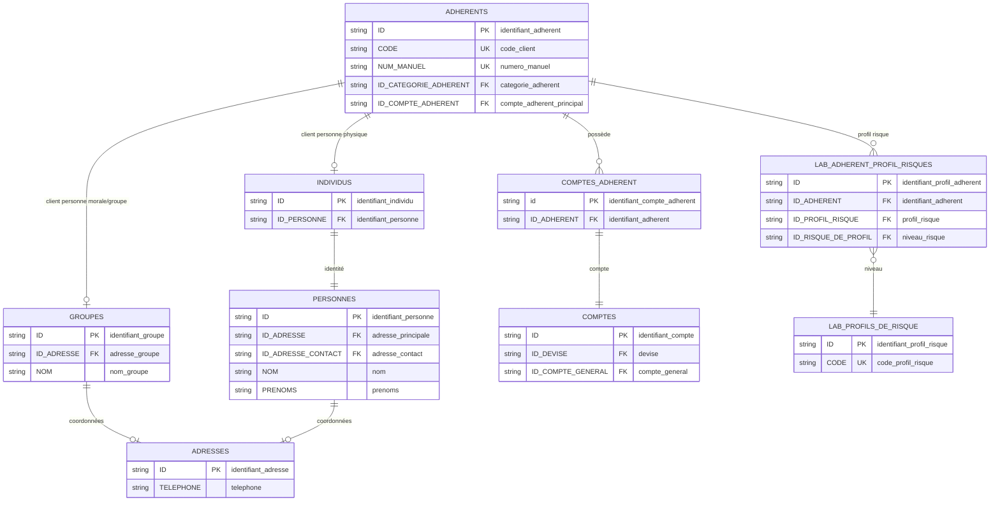

# Perfect Vision — Cycle client

Le cycle client décrit comment Perfect Vision identifie une personne ou une organisation, la rattache à ses comptes, puis permet de contrôler la qualité des informations utilisées par les opérations, l'épargne, le crédit et la conformité.

## Objectif métier

Un client fiable doit pouvoir être retrouvé par son identité, son numéro manuel, son code client, son téléphone et ses comptes. Ce cycle sert donc à répondre à trois questions simples :

- le client existe-t-il une seule fois ?
- ses informations essentielles sont-elles exploitables ?
- ses comptes sont-ils correctement rattachés ?

## Modèle relationnel simplifié



Les attributs indiqués comme `PK` sont les clés primaires ou clés logiques principales. Les attributs `FK` sont les clés secondaires utilisées pour joindre les tables. Par exemple, `ADHERENTS.ID` alimente `COMPTES_ADHERENT.ID_ADHERENT`, puis `COMPTES_ADHERENT.id` permet de retrouver le compte correspondant dans `COMPTES.ID`.

## Tables et vues principales

| Objet SQL | Rôle dans le cycle |
|---|---|
| `ADHERENTS` | Table centrale des clients/adhérents. |
| `INDIVIDUS` | Extension pour les personnes physiques. |
| `GROUPES` | Extension pour les personnes morales ou groupes. |
| `PERSONNES` | Nom, prénoms, sexe, civilité et identité de base. |
| `ADRESSES` | Téléphone, adresse, ville, e-mail. |
| `COMPTES_ADHERENT` | Table de rattachement entre client et compte. |
| `COMPTES` | Comptes rattachés aux clients. |
| `extra_clients_view` | Vue métier qui rassemble identité, téléphone, agence, zone, profession et catégorie client. |

## Lecture relationnelle

| Relation métier | Lecture base de données | Commentaire |
|---|---|---|
| Un adhérent peut être une personne physique. | `ADHERENTS` 1 → 0/1 `INDIVIDUS` | Utilisé lorsque `ID_CATEGORIE_ADHERENT = 'IND'`. |
| Un adhérent peut être une personne morale ou un groupe. | `ADHERENTS` 1 → 0/1 `GROUPES` | Utilisé pour les groupes et organisations. |
| Un adhérent peut avoir un ou plusieurs comptes adhérents. | `ADHERENTS` 1 → n `COMPTES_ADHERENT` | C'est la relation centrale du cycle client. |
| Un compte adhérent pointe vers un compte. | `COMPTES_ADHERENT` n → 1 `COMPTES` | Permet de retrouver la devise, le produit et les mouvements. |
| Un client peut avoir un profil de risque. | `ADHERENTS` 1 → 0/n `LAB_ADHERENT_PROFIL_RISQUES` | Utile pour la conformité et la surveillance. |

En phrase simple :

```text
Un adhérent peut avoir un ou plusieurs comptes_adherent.
Chaque comptes_adherent rattache l'adhérent à un compte.
Le compte devient ensuite le point d'entrée vers les mouvements, l'épargne, le crédit ou la conformité.
```

## Vues, méthodes et procédures utiles

| Objet | Type | Usage |
|---|---|---|
| `extra_clients_view` | Vue | Vue de référence pour restituer le client sans refaire toutes les jointures d'identité. |
| `sp_perf_extra_clients` | Procédure stockée | Extraction client Perfect Vision. |
| `sp_perf_extra_clients_frais_inscription` | Procédure stockée | Suivi des frais d'inscription clients. |
| `sp_perf_extra_clients_tontine` | Procédure stockée | Extraction des clients liés à la tontine, lorsque ce périmètre est utilisé. |

## Requêtes utiles

| N° | Export | Ce que la requête contrôle |
|---:|---|---|
| 024 | `24_cycle_crm_clients_adherents_inscrits_en_doublon_par_code` | Clients en doublon par code. |
| 025 | `25_cycle_crm_clients_adherents_sans_informations_essentielles` | Clients sans informations essentielles. |
| 026 | `26_cycle_crm_clients_adherents_non_valides_ou_droit_d_adhesion_non_paye` | Clients non validés ou droit d'adhésion non payé. |
| 028 | `28_cycle_crm_clients_adherents_sans_compte_adherent_ou_avec_compte_adherent_introuvable` | Clients sans compte ou avec rattachement incohérent. |
| 090 | `90_cycle_crm_clients_liste_des_clients_avec_leurs_comptes_et_devises` | Liste client + comptes + devises. |
| 121 | `121_cycle_crm_clients_departs_et_retours_clients_avec_exposition_epargne_credit` | Départs/retours avec exposition épargne/crédit. |
| 122 | `122_cycle_crm_clients_controle_qualite_des_numeros_de_telephone_clients` | Qualité des numéros de téléphone. |
| 148 | `148_cycle_crm_clients_liste_unique_des_clients_avec_telephone_et_nombre_de_comptes` | Liste unique client/téléphone/nombre de comptes. |

## Points de contrôle

- Un client sans téléphone fiable devient difficile à rapprocher avec la Solution Numérique.
- Le numéro de téléphone est une clé de rapprochement, mais il doit être normalisé avant comparaison.
- Les doublons client peuvent fausser les indicateurs de portefeuille, d'épargne et de crédit.
- Les comptes sans rattachement client exploitable doivent être isolés avant toute analyse financière.
