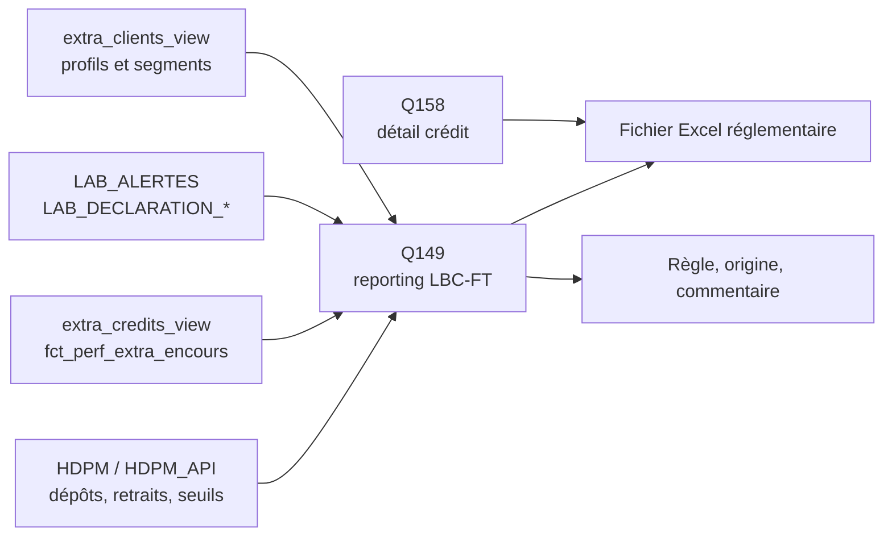

# Perfect Vision — Conformité

Le cycle Conformité regroupe les contrôles LBC-FT, les alertes, les déclarations, les profils de risque, les sanctions et la qualité des données nécessaires au reporting réglementaire.

## Objectif métier

La conformité doit permettre de :

- produire un reporting LBC-FT documenté ;
- expliquer chaque chiffre par une règle d'alimentation ;
- isoler les rubriques couvertes, partielles ou non couvertes ;
- conserver une piste d'audit pour les alertes, déclarations et sanctions ;
- éviter les consolidations monétaires non justifiées.

## Modèle relationnel simplifié

```mermaid
erDiagram
    ADHERENTS {
        string ID PK "identifiant_adherent"
        string CODE UK "code_client"
        string NUM_MANUEL UK "numero_manuel"
    }
    LAB_ADHERENT_PROFIL_RISQUES {
        string ID PK "identifiant_profil_adherent"
        string ID_ADHERENT FK "identifiant_adherent"
        string ID_PROFIL_RISQUE FK "profil_risque"
        string ID_RISQUE_DE_PROFIL FK "niveau_risque"
        string ID_POINT_SERVICE FK "point_service"
    }
    LAB_PROFILS_DE_RISQUE {
        string ID PK "identifiant_profil_risque"
        string CODE UK "code_profil_risque"
    }
    OPERATIONS {
        string ID PK "identifiant_operation"
        string ID_TYPE_OPERATION FK "type_operation"
        string ID_POINT_SERVICE FK "point_service"
        datetime DATE_OPERATION "date_operation"
    }
    LAB_ALERTES {
        string ID PK "identifiant_alerte"
        string ID_ADHERENT FK "identifiant_adherent"
        string ID_OPERATION FK "operation"
        string ID_DEVISE FK "devise"
        string ID_TYPE_OPERATION FK "type_operation"
        decimal MONTANT "montant_alerte"
    }
    LAB_DECLARATION_SOUPCONS {
        string ID PK "identifiant_declaration_soupcon"
    }
    LAB_DECLARATION_CENTIF {
        string ID PK "identifiant_declaration_centif"
        string NUMERO UK "numero_declaration"
        string NOM "nom"
        string PRENOMS "prenoms"
    }
    LAB_BLACKLISTS {
        string ID PK "identifiant_blacklist"
        string IDENTIFIANT UK "identifiant_sanction"
        string NOM "nom_reference"
        string NUM_MANUEL "numero_manuel"
    }
    LAB_BLACKLIST_NAMES {
        string ID PK "identifiant_nom_blacklist"
        string ID_BLACKLIST FK "identifiant_blacklist"
        string NOM "nom_blacklist"
    }
    LAB_BLACKLIST_PIECES {
        string ID PK "identifiant_piece_blacklist"
        string ID_BLACKLIST FK "identifiant_blacklist"
    }
    COMPTES {
        string ID PK "identifiant_compte"
        string ID_DEVISE FK "devise"
    }
    REACTIVATION_COMPTE_EPG {
        string ID PK "identifiant_reactivation"
        string ID_CLOTURE_COMPTE FK "compte_cloture"
        string ID_OPERATION FK "operation"
        string ID_DEVISE FK "devise"
    }
    ADHERENTS ||--o{ LAB_ADHERENT_PROFIL_RISQUES : "profil"
    LAB_ADHERENT_PROFIL_RISQUES }o--|| LAB_PROFILS_DE_RISQUE : "niveau risque"
    OPERATIONS ||--o{ LAB_ALERTES : "alerte possible"
    LAB_ALERTES }o--o| LAB_DECLARATION_SOUPCONS : "peut conduire à"
    LAB_DECLARATION_CENTIF ||--o{ LAB_DECLARATION_SOUPCONS : "référence réglementaire"
    LAB_BLACKLISTS ||--o{ LAB_BLACKLIST_NAMES : "identité"
    LAB_BLACKLISTS ||--o{ LAB_BLACKLIST_PIECES : "pièces"
    COMPTES ||--o{ REACTIVATION_COMPTE_EPG : "compte dormant"
```



Les clés de conformité servent surtout à garder la traçabilité : `LAB_ALERTES.ID_OPERATION` relie l'alerte à l'opération, `LAB_ALERTES.ID_ADHERENT` relie l'alerte au client, et `ID_DEVISE` protège la lecture des montants par devise. Pour les sanctions, `LAB_BLACKLISTS.ID` est repris dans les tables enfants comme `LAB_BLACKLIST_NAMES.ID_BLACKLIST` et `LAB_BLACKLIST_PIECES.ID_BLACKLIST`.

## Tables principales

| Objet SQL | Rôle dans le cycle |
|---|---|
| `LAB_ALERTES` | Alertes LBC-FT, montants, devise, état et type d'alerte. |
| `LAB_DECLARATION_SOUPCONS` | Déclarations de soupçon. |
| `LAB_DECLARATION_CENTIF` | Déclarations ou informations liées à la CENTIF. |
| `LAB_ADHERENT_PROFIL_RISQUES` | Profil risque rattaché au client. |
| `LAB_PROFILS_DE_RISQUE` | Niveaux et libellés de risque. |
| `LAB_BLACKLISTS` | Référentiel des listes de sanctions. |
| `LAB_BLACKLIST_NAMES` | Noms associés aux listes de sanctions. |
| `REACTIVATION_COMPTE_EPG` | Réactivation de comptes dormants. |
| `HDPM`, `HDPM_API` | Mouvements utilisés pour dépôts, retraits, seuils et localisation. |
| `extra_clients_view` | Identité client pour segmentation et contrôle. |
| `extra_credits_view` | Encours crédit pour les lignes réglementaires crédit. |

## Lecture relationnelle

| Relation métier | Lecture base de données | Commentaire |
|---|---|---|
| Un adhérent peut avoir plusieurs profils ou historiques de risque. | `ADHERENTS` 1 → n `LAB_ADHERENT_PROFIL_RISQUES` | Sert à la surveillance renforcée. |
| Un profil de risque appartient à un référentiel de risque. | `LAB_ADHERENT_PROFIL_RISQUES` n → 1 `LAB_PROFILS_DE_RISQUE` | Permet de qualifier le niveau de risque. |
| Une opération peut générer une ou plusieurs alertes. | `OPERATIONS` 1 → 0/n `LAB_ALERTES` | Une alerte est un signal de revue, pas une preuve de fraude. |
| Une alerte peut conduire à une déclaration. | `LAB_ALERTES` 0/n → 0/n `LAB_DECLARATION_SOUPCONS` | Le lien exact dépend des champs de référence disponibles. |
| Une liste de sanctions peut avoir plusieurs identités associées. | `LAB_BLACKLISTS` 1 → n tables enfants | Noms, pseudonymes, pièces ou autres informations d'identification. |
| Les mouvements HDPM alimentent les seuils de reporting. | `HDPM` / `HDPM_API` n → reporting LBC-FT | Les lignes sont agrégées par période, devise et rubrique. |

En lecture métier :

```text
Le client a une identité et éventuellement un profil de risque.
Ses opérations peuvent générer des alertes.
Les alertes et déclarations alimentent la conformité.
Les mouvements comptables alimentent les seuils réglementaires.
Les listes de sanctions servent au contrôle d'identification.
```

## Requêtes utiles

| N° | Export | Usage |
|---:|---|---|
| 048 | `48_cycle_conformite_lbc_ft_rubriques_lbc_ft_non_couvertes_automatiquement_et_pistes_de_mapping` | Rubriques non couvertes et pistes de mapping. |
| 149 | `149_cycle_conformite_reporting_lbc_ft` | Requête principale du reporting LBC-FT par période. |
| 150 | `150_cycle_conformite_alertes_lbc_ft_detaillees` | Alertes détaillées pour traitement Conformité. |
| 151 | `151_cycle_conformite_declarations_soupcon_centif` | Déclarations de soupçon et CENTIF. |
| 152 | `152_cycle_conformite_clients_profils_risque` | Clients à risque et surveillance renforcée. |
| 153 | `153_cycle_conformite_referentiel_listes_sanctions` | Listes de sanctions et qualité d'identification. |
| 154 | `154_cycle_conformite_comptes_dormants_reactives` | Comptes dormants réactivés. |
| 155 | `155_cycle_conformite_qualite_donnees_lbc_ft` | Qualité des données du dispositif LBC-FT. |
| 156 | `156_cycle_conformite_lbc_ft_socle_unique_analyses_38_39_48_57_149_155` | Socle unique pour l'application Streamlit. |
| 158 | `158_cycle_conformite_detail_credits_reporting_lbc_ft` | Détail des crédits alimentant les lignes 15 à 24 du canevas. |

## Circuit du reporting LBC-FT



## Règles de lecture

| Statut | Sens |
|---|---|
| `COUVERT` | Source directe et règle de calcul exploitable. |
| `PARTIEL` | Calcul possible, mais dépendant d'une nomenclature ou d'un mapping à valider. |
| `NON_COUVERT` | Source opérationnelle non identifiée ; il faut garder la ligne sans inventer de chiffre. |

## Points de contrôle

- Les montants USD et CDF restent séparés dans les sources.
- `@convertir_affichage_cdf` sert à produire une colonne d'affichage réglementaire, pas à remplacer la devise d'origine.
- Les segments client comme PPE, MPME, OBNL, EME ou non-résident doivent être validés par la Conformité.
- Les canaux non identifiés dans le schéma, comme internet banking, agent banking ou POS, restent `NON_COUVERT` tant que la source n'est pas confirmée.
