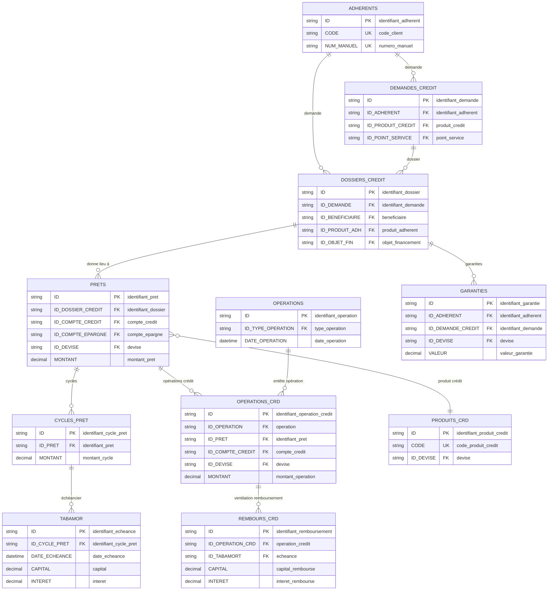
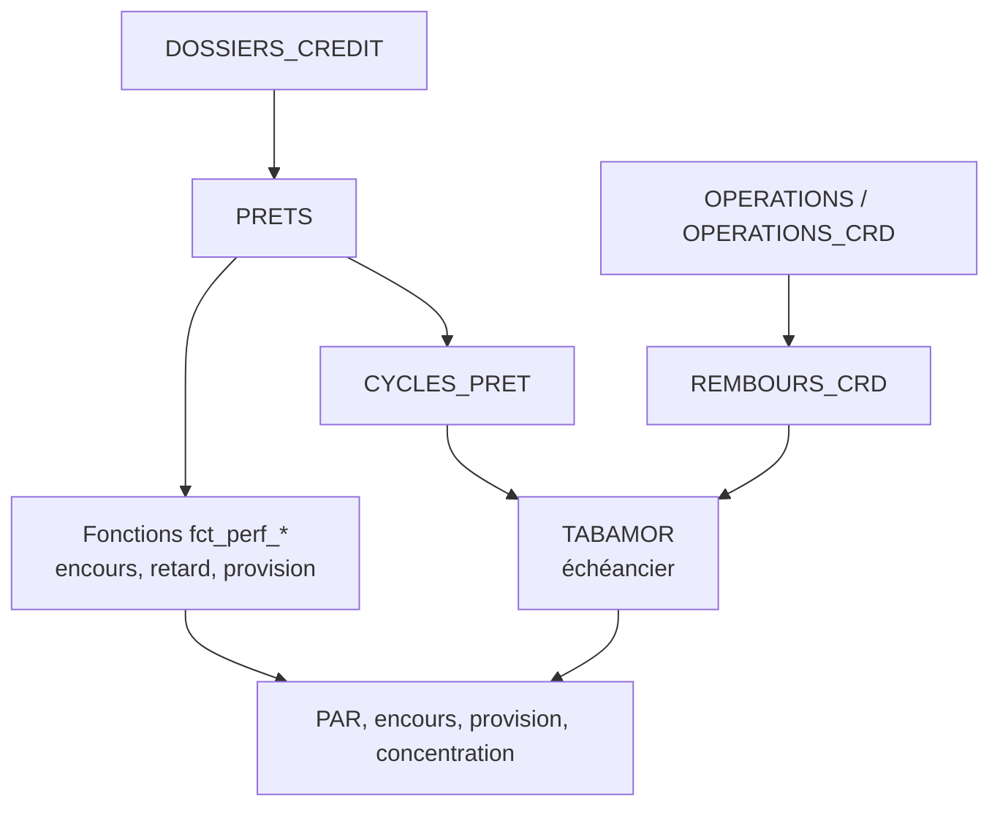

# Perfect Vision — Cycle crédit

Le cycle crédit couvre les demandes, les dossiers, les prêts, les cycles, les échéanciers, les remboursements, les garanties, la provision et les indicateurs PAR.

## Objectif métier

Le cycle crédit permet de suivre :

- les crédits accordés et décaissés ;
- les encours à une date ;
- les échéances dues, payées ou impayées ;
- le PAR et la provision ;
- les garanties, cautions et couvertures ;
- les anomalies de validation ou de comptabilisation.

## Modèle relationnel simplifié



La lecture technique repose surtout sur `PRETS.ID`, `CYCLES_PRET.ID`, `TABAMOR.ID`, `OPERATIONS_CRD.ID_PRET` et `REMBOURS_CRD.ID_TABAMORT`. Ces clés permettent de passer du dossier au prêt, puis du prêt à ses échéances et remboursements sans additionner plusieurs fois les mêmes écritures.

## Tables et vues principales

| Objet SQL | Rôle dans le cycle |
|---|---|
| `DEMANDES_CREDIT` | Demandes ou intentions de crédit. |
| `DOSSIERS_CREDIT` | Dossier de crédit, montant sollicité, accordé, garanties et paramètres. |
| `PRETS` | Prêt effectivement créé. |
| `CYCLES_PRET` | Cycle de vie ou renouvellement du prêt. |
| `TABAMOR` | Échéancier du prêt. |
| `OPERATIONS_CRD` | Opérations liées au prêt. |
| `REMBOURS_CRD` | Ventilation des remboursements par échéance. |
| `GARANTIES` | Garanties et cautions liées au dossier de crédit. |
| `extra_credits_view` | Vue métier de lecture crédit. |

## Lecture relationnelle

| Relation métier | Lecture base de données | Commentaire |
|---|---|---|
| Un adhérent peut avoir plusieurs dossiers de crédit. | `ADHERENTS` 1 → n `DOSSIERS_CREDIT` | Un client peut demander plusieurs crédits dans le temps. |
| Un dossier peut donner lieu à un prêt. | `DOSSIERS_CREDIT` 1 → 0/n `PRETS` | Certains dossiers peuvent être refusés ou rester sans prêt actif. |
| Un prêt peut avoir plusieurs cycles. | `PRETS` 1 → n `CYCLES_PRET` | Le cycle permet de suivre la vie du prêt. |
| Un cycle de prêt contient plusieurs échéances. | `CYCLES_PRET` 1 → n `TABAMOR` | `TABAMOR` est la base de lecture des échéances. |
| Une échéance peut recevoir plusieurs remboursements. | `TABAMOR` 1 → 0/n `REMBOURS_CRD` | Les remboursements peuvent être partiels ou multiples. |
| Un prêt peut avoir plusieurs opérations crédit. | `PRETS` 1 → n `OPERATIONS_CRD` | Décaissements, remboursements, régularisations. |
| Un dossier peut avoir plusieurs garanties. | `DOSSIERS_CREDIT` 1 → 0/n `GARANTIES` | À rapprocher du montant accordé et du risque. |

En phrase simple :

```text
Un adhérent peut avoir plusieurs dossiers de crédit.
Un dossier peut devenir un prêt.
Un prêt peut avoir plusieurs cycles.
Chaque cycle possède des échéances.
Chaque échéance peut être remboursée en une ou plusieurs fois.
```

## Vues, fonctions et procédures utiles

| Objet | Type | Usage |
|---|---|---|
| `extra_credits_view` | Vue | Vue principale pour restituer les crédits avec client, produit, devise, cycle et dates. |
| `fct_perf_extra_encours(@date_situation, @idpret)` | Fonction | Encours crédit à une date. |
| `fct_perf_extra_retard(@date_situation, @idpret)` | Fonction | Retard du crédit. |
| `fct_perf_extra_provision(@date_situation, @idpret)` | Fonction | Provision estimée. |
| `fct_perf_extra_capital_du(...)` | Fonction | Capital dû à une date ou échéance. |
| `fct_perf_extra_interet_du(...)` | Fonction | Intérêt dû. |
| `fct_perf_extra_caution(@date_situation, @idpret)` | Fonction | Caution ou couverture associée. |
| `sp_perf_extra_credits` | Procédure stockée | Extraction crédit principale. |
| `sp_perf_extra_credits_situation` | Procédure stockée | Situation crédit à une date. |
| `sp_perf_extra_demande_credit` | Procédure stockée | Demandes de crédit. |
| `sp_perf_extra_garanties_credit` | Procédure stockée | Garanties de crédit. |
| `sp_perf_extra_frais_credit` | Procédure stockée | Frais de crédit. |

## Requêtes utiles

| N° | Export | Ce que la requête contrôle |
|---:|---|---|
| 060 | `60_cycle_credit_prets_incomplets_sans_dossier_sans_compte_credit_sans_compte_epargne_ou_sans_cycle` | Prêts incomplets. |
| 069 | `69_cycle_credit_prets_decaisses_sans_validation_prealable_exploitable` | Décaissements sans validation préalable exploitable. |
| 071 | `71_cycle_credit_caution_financiere_insuffisante_par_rapport_au_dossier` | Caution insuffisante. |
| 072 | `72_cycle_credit_garanties_sans_garant_identifiable_ou_sans_piece_exploitable` | Garanties inexploitables. |
| 073 | `73_cycle_credit_dossiers_avec_analyse_obligatoire_absente_ou_inachevee` | Analyse obligatoire absente ou inachevée. |
| 085 | `85_cycle_credit_clients_qui_terminent_leur_credit_par_mois_ou_sur_la_periode` | Clients qui terminent leur crédit. |
| 091 | `91_cycle_credit_credits_en_cours_ou_termines_avec_echeances_impayees_sur_la_periode` | Crédits avec échéances impayées. |
| 096 | `96_cycle_credit_dashboard_par_details_credit_a_la_date_de_fin` | Détail PAR à date. |
| 098 | `98_cycle_credit_dashboard_top_encours_credits_par_client` | Top encours crédits par client. |
| 099 | `99_cycle_credit_dashboard_decaissements_mensuels_par_agence_et_produit` | Décaissements mensuels. |
| 100 | `100_cycle_credit_dashboard_echeances_futures_des_prets_en_cours` | Échéances futures. |
| 105 | `105_cycle_credit_dashboard_concentration_top_10_pourcent_des_encours` | Concentration du portefeuille. |
| 106 | `106_cycle_credit_dashboard_couverture_credit_par_epargne_et_garanties` | Couverture crédit par épargne et garanties. |
| 116 | `116_cycle_credit_couverture_caution_et_garanties_par_rapport_au_credit_accorde` | Couverture caution/garantie. |
| 136 | `136_cycle_credit_remboursements_credit_encaisses_mais_non_imputes_correctement_au_pret` | Remboursements encaissés non imputés correctement. |
| 142 | `142_cycle_credit_credits_decaisses_sans_mouvement_comptable_coherent` | Décaissements sans mouvement comptable cohérent. |
| 143 | `143_cycle_credit_remboursements_credit_recus_apres_echeance_a_suivre_pour_par` | Remboursements après échéance. |
| 145 | `145_cycle_credit_liste_detaillee_des_prets_avec_impayes` | Liste des prêts avec impayés. |
| 146 | `146_cycle_credit_liste_detaillee_des_clients_avec_echeances_sur_la_periode` | Échéances clients sur une période. |
| 147 | `147_cycle_credit_comptes_ordinaires_et_disponibilites_clients` | Disponibilités clients avec impayé ou échéance. |

## Lecture analytique



## Points de contrôle

- Un encours crédit se calcule à une date de situation, pas seulement avec le montant initial.
- Les échéances impayées doivent être rapprochées des remboursements réels.
- Les garanties et cautions doivent être lisibles avant de conclure qu'un crédit est couvert.
- Les requêtes de crédit doivent toujours garder la devise.
