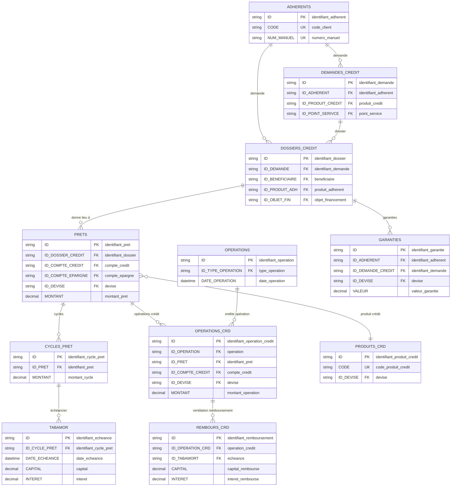
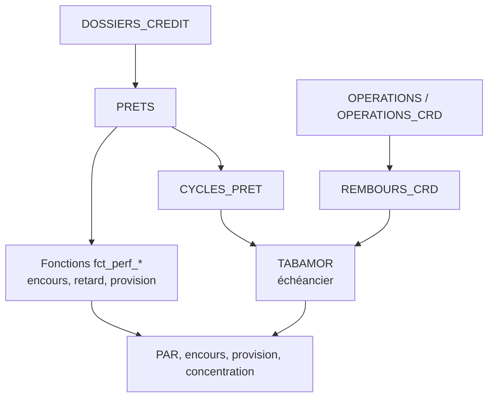

# Perfect Vision — Cycle crédit

Le cycle crédit couvre les demandes, les dossiers, les prêts, les cycles, les échéanciers, les remboursements, les garanties, la provision et les indicateurs PAR.

## Objectif métier

Le cycle crédit permet de suivre :

- les crédits accordés et décaissés ;
- les encours à une date ;
- les échéances dues, payées ou impayées ;
- le PAR et la provision ;
- les garanties, cautions et couvertures ;
- les anomalies de validation ou de comptabilisation.

## Modèle relationnel simplifié



La lecture technique repose surtout sur `PRETS.ID`, `CYCLES_PRET.ID`, `TABAMOR.ID`, `OPERATIONS_CRD.ID_PRET` et `REMBOURS_CRD.ID_TABAMORT`. Ces clés permettent de passer du dossier au prêt, puis du prêt à ses échéances et remboursements sans additionner plusieurs fois les mêmes écritures.

## Tables et vues principales

| Objet SQL | Rôle dans le cycle |
|---|---|
| `DEMANDES_CREDIT` | Demandes ou intentions de crédit. |
| `DOSSIERS_CREDIT` | Dossier de crédit, montant sollicité, accordé, garanties et paramètres. |
| `PRETS` | Prêt effectivement créé. |
| `CYCLES_PRET` | Cycle de vie ou renouvellement du prêt. |
| `TABAMOR` | Échéancier du prêt. |
| `OPERATIONS_CRD` | Opérations liées au prêt. |
| `REMBOURS_CRD` | Ventilation des remboursements par échéance. |
| `GARANTIES` | Garanties et cautions liées au dossier de crédit. |
| `extra_credits_view` | Vue métier de lecture crédit. |

## Lecture relationnelle

| Relation métier | Lecture base de données | Commentaire |
|---|---|---|
| Un adhérent peut avoir plusieurs dossiers de crédit. | `ADHERENTS` 1 → n `DOSSIERS_CREDIT` | Un client peut demander plusieurs crédits dans le temps. |
| Un dossier peut donner lieu à un prêt. | `DOSSIERS_CREDIT` 1 → 0/n `PRETS` | Certains dossiers peuvent être refusés ou rester sans prêt actif. |
| Un prêt peut avoir plusieurs cycles. | `PRETS` 1 → n `CYCLES_PRET` | Le cycle permet de suivre la vie du prêt. |
| Un cycle de prêt contient plusieurs échéances. | `CYCLES_PRET` 1 → n `TABAMOR` | `TABAMOR` est la base de lecture des échéances. |
| Une échéance peut recevoir plusieurs remboursements. | `TABAMOR` 1 → 0/n `REMBOURS_CRD` | Les remboursements peuvent être partiels ou multiples. |
| Un prêt peut avoir plusieurs opérations crédit. | `PRETS` 1 → n `OPERATIONS_CRD` | Décaissements, remboursements, régularisations. |
| Un dossier peut avoir plusieurs garanties. | `DOSSIERS_CREDIT` 1 → 0/n `GARANTIES` | À rapprocher du montant accordé et du risque. |

En phrase simple :

```text
Un adhérent peut avoir plusieurs dossiers de crédit.
Un dossier peut devenir un prêt.
Un prêt peut avoir plusieurs cycles.
Chaque cycle possède des échéances.
Chaque échéance peut être remboursée en une ou plusieurs fois.
```

## Vues, fonctions et procédures utiles

| Objet | Type | Usage |
|---|---|---|
| `extra_credits_view` | Vue | Vue principale pour restituer les crédits avec client, produit, devise, cycle et dates. |
| `fct_perf_extra_encours(@date_situation, @idpret)` | Fonction | Encours crédit à une date. |
| `fct_perf_extra_retard(@date_situation, @idpret)` | Fonction | Retard du crédit. |
| `fct_perf_extra_provision(@date_situation, @idpret)` | Fonction | Provision estimée. |
| `fct_perf_extra_capital_du(...)` | Fonction | Capital dû à une date ou échéance. |
| `fct_perf_extra_interet_du(...)` | Fonction | Intérêt dû. |
| `fct_perf_extra_caution(@date_situation, @idpret)` | Fonction | Caution ou couverture associée. |
| `sp_perf_extra_credits` | Procédure stockée | Extraction crédit principale. |
| `sp_perf_extra_credits_situation` | Procédure stockée | Situation crédit à une date. |
| `sp_perf_extra_demande_credit` | Procédure stockée | Demandes de crédit. |
| `sp_perf_extra_garanties_credit` | Procédure stockée | Garanties de crédit. |
| `sp_perf_extra_frais_credit` | Procédure stockée | Frais de crédit. |

## Requêtes utiles

Les requêtes ci-dessous sont classées en privilégiant d'abord les analyses de portefeuille, de recouvrement et de décision, puis les contrôles d'octroi ou d'anomalies.

| Priorité | N° | Export | Ce que la requête apporte | Commentaire |
|---:|---:|---|---|---|
| 1 | 162 | `162_cycle_credit_encours_credit_detaille_a_date` | Encours crédit détaillé à la date de situation. | Requête de référence pour l'envoi hebdomadaire des encours crédits : client, téléphone, produit, devise, encours, impayés, retard, PAR1/PAR30/PAR60/PAR90/PAR180 et action recommandée. |
| 2 | 161 | `161_cycle_credit_rapport_comparatif_portefeuille_credit_par_anciennete_et_produit` | Rapport comparatif du portefeuille par ancienneté de retard et par produit. | Reproduit la logique du rapport opérationnel crédit : portefeuille sain, crédits en retard, PAR, production et écarts entre deux dates. |
| 3 | 096 | `96_cycle_credit_dashboard_par_details_credit_a_la_date_de_fin` | Détail PAR à date. | Base analytique du risque crédit : encours, provision, retard et ventilation PAR par devise. |
| 4 | 145 | `145_cycle_credit_liste_detaillee_des_prets_avec_impayes` | Liste des prêts avec impayés. | À utiliser pour le recouvrement : elle donne les prêts à traiter et le solde restant dû. |
| 5 | 146 | `146_cycle_credit_liste_detaillee_des_clients_avec_echeances_sur_la_periode` | Échéances clients sur une période. | Utile pour préparer les relances à venir et suivre les montants attendus par date. |
| 6 | 100 | `100_cycle_credit_dashboard_echeances_futures_des_prets_en_cours` | Échéances futures. | Donne une vision prévisionnelle des remboursements attendus. |
| 7 | 098 | `98_cycle_credit_dashboard_top_encours_credits_par_client` | Top encours crédits par client. | Sert à surveiller les plus fortes expositions individuelles. |
| 8 | 105 | `105_cycle_credit_dashboard_concentration_top_10_pourcent_des_encours` | Concentration du portefeuille. | Aide la Direction à mesurer si le risque est concentré sur peu de clients. |
| 9 | 106 | `106_cycle_credit_dashboard_couverture_credit_par_epargne_et_garanties` | Couverture crédit par épargne et garanties. | Rapproche l'encours crédit avec l'épargne, les cautions et les garanties disponibles. |
| 10 | 147 | `147_cycle_credit_comptes_ordinaires_et_disponibilites_clients` | Disponibilités clients avec impayé ou échéance. | Aide à orienter le recouvrement, sans présenter l'épargne disponible comme une compensation automatique. |
| 11 | 099 | `99_cycle_credit_dashboard_decaissements_mensuels_par_agence_et_produit` | Décaissements mensuels. | Utile pour suivre la production crédit et les produits qui portent l'activité. |
| 12 | 085 | `85_cycle_credit_clients_qui_terminent_leur_credit_par_mois_ou_sur_la_periode` | Clients qui terminent leur crédit. | Aide à préparer les renouvellements prudents et la fidélisation. |
| 13 | 091 | `91_cycle_credit_credits_en_cours_ou_termines_avec_echeances_impayees_sur_la_periode` | Crédits avec échéances impayées. | Sert à vérifier les échéances de période non totalement couvertes. |
| 14 | 143 | `143_cycle_credit_remboursements_credit_recus_apres_echeance_a_suivre_pour_par` | Remboursements après échéance. | Important pour comprendre le comportement de remboursement, même si le paiement finit par être encaissé. |
| 15 | 136 | `136_cycle_credit_remboursements_credit_encaisses_mais_non_imputes_correctement_au_pret` | Remboursements encaissés non imputés correctement. | Protège le client et le portefeuille : un paiement mal imputé peut créer un faux retard. |
| 16 | 069 | `69_cycle_credit_prets_decaisses_sans_validation_prealable_exploitable` | Décaissements sans validation préalable exploitable. | Contrôle d'octroi prioritaire : un crédit décaissé doit avoir une validation exploitable. |
| 17 | 071 | `71_cycle_credit_caution_financiere_insuffisante_par_rapport_au_dossier` | Caution insuffisante. | À suivre pour mesurer les écarts entre politique d'octroi et couverture constatée. |
| 18 | 116 | `116_cycle_credit_couverture_caution_et_garanties_par_rapport_au_credit_accorde` | Couverture caution/garantie. | Donne une lecture plus large de la couverture du crédit accordé. |
| 19 | 072 | `72_cycle_credit_garanties_sans_garant_identifiable_ou_sans_piece_exploitable` | Garanties inexploitables. | Contrôle documentaire : une garantie sans garant exploitable fragilise le dossier. |
| 20 | 073 | `73_cycle_credit_dossiers_avec_analyse_obligatoire_absente_ou_inachevee` | Analyse obligatoire absente ou inachevée. | Aide à revoir la qualité d'instruction avant ou après octroi. |
| 21 | 142 | `142_cycle_credit_credits_decaisses_sans_mouvement_comptable_coherent` | Décaissements sans mouvement comptable cohérent. | Contrôle comptable : un décaissement doit être cohérent avec les écritures associées. |
| 22 | 060 | `60_cycle_credit_prets_incomplets_sans_dossier_sans_compte_credit_sans_compte_epargne_ou_sans_cycle` | Prêts incomplets. | Contrôle structurel pour identifier les prêts dont les rattachements techniques sont insuffisants. |

## Requêtes recommandées pour le cockpit Crédits

Le cockpit Crédits doit suivre le portefeuille, les décaissements, les échéances, le PAR, les impayés, les remboursements, les garanties et la concentration du risque. Les indicateurs d'encours et de PAR doivent être lus à une date de situation, tandis que les décaissements et remboursements se lisent sur une période.

| Priorité | Requête | Export | Utilité pour le cockpit | Commentaire |
|---:|---:|---|---|---|
| 1 | `123` | `123_cycle_credit_streamlit` | Source large du cycle crédit : prêts, dossiers, cycles, clients, produits et dates. | Base complète pour alimenter les analyses crédit et les contrôles transversaux. |
| 2 | `096` | `96_cycle_credit_dashboard_par_details_credit_a_la_date_de_fin` | Détail PAR, provision et encours à la date de fin. | Requête centrale pour suivre le risque réel du portefeuille à une date donnée. |
| 3 | `098` | `98_cycle_credit_dashboard_top_encours_credits_par_client` | Top encours crédits par client. | Met en évidence les plus fortes expositions individuelles. |
| 4 | `145` | `145_cycle_credit_liste_detaillee_des_prets_avec_impayes` | Liste détaillée des prêts avec impayés à la date de situation. | Feuille prioritaire pour le recouvrement et la surveillance des impayés. |
| 5 | `091` | `91_cycle_credit_credits_en_cours_ou_termines_avec_echeances_impayees_sur_la_periode` | Crédits avec échéances impayées sur la période. | Permet de voir les impayés liés à une période précise, même si le crédit est terminé. |
| 6 | `095` | `95_cycle_credit_credits_en_cours_ou_termines_avec_echeances_sans_impayees_sur_la_periode` | Crédits avec échéances totalement remboursées sur la période. | Donne la population saine pour comparer avec les crédits à problème. |
| 7 | `097` | `97_cycle_credit_dashboard_synthese_par_et_provision_par_produit_et_agence` | Synthèse PAR/provision par produit et agence. | Aide la Direction à localiser le risque par agence et par produit. |
| 8 | `099` | `99_cycle_credit_dashboard_decaissements_mensuels_par_agence_et_produit` | Décaissements mensuels par agence et produit. | Sert à suivre la production crédit et les tendances commerciales. |
| 9 | `100` | `100_cycle_credit_dashboard_echeances_futures_des_prets_en_cours` | Échéances futures des prêts en cours. | Prépare les relances et les prévisions de remboursement. |
| 10 | `105` | `105_cycle_credit_dashboard_concentration_top_10_pourcent_des_encours` | Concentration du portefeuille sur les plus gros encours. | Permet de mesurer si le risque est concentré sur peu de clients ou dossiers. |
| 11 | `106` | `106_cycle_credit_dashboard_couverture_credit_par_epargne_et_garanties` | Couverture crédit par épargne, cautions et garanties. | Compare le risque crédit aux protections disponibles. |
| 12 | `114` | `114_cycle_credit_pipeline_credit_et_delais_instruction_decision_decaissement` | Pipeline crédit et délais instruction/décision/décaissement. | Mesure l'efficacité du processus crédit avant décaissement. |
| 13 | `116` | `116_cycle_credit_couverture_caution_et_garanties_par_rapport_au_credit_accorde` | Couverture caution et garanties par rapport au crédit accordé. | Contrôle si les garanties attendues couvrent correctement le crédit accordé. |
| 14 | `136` | `136_cycle_credit_remboursements_credit_encaisses_mais_non_imputes_correctement_au_pret` | Remboursements encaissés mais non imputés correctement. | Requête critique pour éviter qu'un paiement client ne reste mal ventilé. |
| 15 | `142` | `142_cycle_credit_credits_decaisses_sans_mouvement_comptable_coherent` | Crédits décaissés sans mouvement comptable cohérent. | Vérifie que le décaissement crédit a bien une trace comptable cohérente. |
| 16 | `143` | `143_cycle_credit_remboursements_credit_recus_apres_echeance_a_suivre_pour_par` | Remboursements reçus après échéance, utiles pour le suivi PAR. | Aide à comprendre la discipline de remboursement et les retards récurrents. |
| 17 | `146` | `146_cycle_credit_liste_detaillee_des_clients_avec_echeances_sur_la_periode` | Échéances clients sur une période. | Liste de travail pour planifier les relances et suivre les échéances attendues. |
| 18 | `158` | `158_cycle_conformite_detail_credits_reporting_lbc_ft` | Détail des crédits alimentant le reporting LBC-FT. | Sert à justifier les lignes crédit du reporting réglementaire. |
| 19 | `161` | `161_cycle_credit_rapport_comparatif_portefeuille_credit_par_anciennete_et_produit` | Rapport comparatif du portefeuille crédit par ancienneté de retard et par produit. | Reproduit le besoin opérationnel du service Crédit : portefeuille sain, retard, PAR 30, PAR 60, PAR 90, production et écart entre deux dates, sans mélanger les devises. |

Feuilles cockpit conseillées : `Credit_Socle`, `Credit_PAR_Detail`, `Credit_Impaye`, `Credit_Top_Clients`, `Credit_Echeances_Futures`, `Credit_Decaissements`, `Credit_Concentration`, `Credit_Couverture_Epargne`, `Credit_Remboursements_Tardifs`, `Credit_Anomalies_Imputation`, `Credit_Pipeline`.

## Requêtes prioritaires pour le pilotage du portefeuille

Ces requêtes sont à mettre en avant dans les cockpits et les rapports crédit, car elles répondent directement aux questions de pilotage : qualité du portefeuille, respect de la politique d'octroi, stabilisation du PAR et suivi des indicateurs clés. Les colonnes visibles doivent rester opérationnelles : nom du client, téléphone, produit, devise, montant, date, retard, statut, action recommandée ou commentaire métier. Les identifiants techniques restent utiles dans les calculs, mais ne doivent pas alourdir les tableaux remis aux utilisateurs.

| Axe de pilotage | Requêtes à privilégier | Lecture métier |
|---|---|---|
| Analyse de la qualité du portefeuille de crédit | `096`, `097`, `145`, `161`, `162` | Mesurer l'encours actif, les retards, les tranches PAR, les impayés et la concentration par produit ou par client. |
| Évaluation des politiques d'octroi de crédit | `069`, `071`, `073`, `106`, `116`, `142` | Vérifier que le crédit accordé respecte les validations, la couverture par épargne ou caution, et la cohérence comptable du décaissement. |
| Stratégie de stabilisation du PAR | `100`, `143`, `145`, `146`, `147`, `161` | Identifier les échéances proches, les remboursements tardifs, les prêts en retard et les disponibilités pouvant orienter les actions de recouvrement. |
| Suivi des indicateurs clés | `096`, `097`, `098`, `099`, `105`, `109`, `123`, `162` | Alimenter les KPI : encours, nouveaux décaissements, top expositions, PAR1, PAR30, PAR60, PAR90, remboursement et production. |

### Lecture des garanties DAT dans la requête 144

La requête 144 ne doit pas conclure qu'un DAT garantit un crédit simplement parce que le client possède un DAT. Le lien doit être prouvé dans la base.

Deux chemins sont contrôlés :

- `GARANTIES.ID_OPERATION_DEPOT` vers `OPERATIONS_DAT`, lorsque la garantie est portée par une opération DAT ;
- `CAUTIONS_FINANCIERE_COMPTE.ID_COMPTE_ADHERENT` vers `DOSSIERS_DAT.ID_COMPTE_DAT`, lorsque la caution financière pointe directement vers un compte DAT.

Lors du test sur `BB_VISION_PROD`, la table `GARANTIES` était vide et les cautions financières observées pointaient vers des comptes ordinaires/DAV, pas vers des comptes DAT. Dans ce cas, la valeur `DAT utilisé comme garantie = Non` est cohérente. Si Perfect Vision commence à utiliser des comptes DAT comme caution, cette logique doit permettre de les détecter.

## Lecture analytique



## Points de contrôle

- Un encours crédit se calcule à une date de situation, pas seulement avec le montant initial.
- Les échéances impayées doivent être rapprochées des remboursements réels.
- Les garanties et cautions doivent être lisibles avant de conclure qu'un crédit est couvert.
- Les requêtes de crédit doivent toujours garder la devise.
