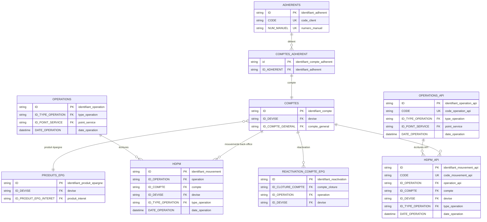
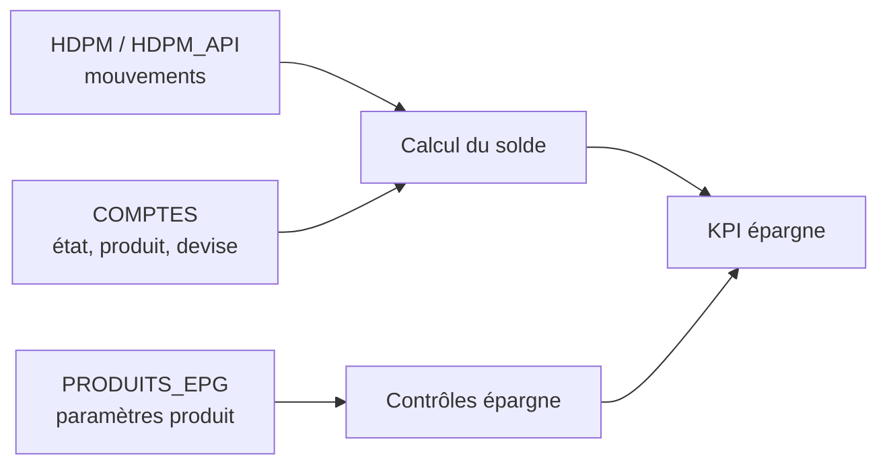

# Perfect Vision — Cycle épargne

Le cycle épargne suit les comptes ordinaires, les dépôts à terme, les mouvements sur comptes, les produits d'épargne et les situations de comptes inactifs ou dormants.

## Objectif métier

L'épargne doit permettre de connaître :

- le solde du client par compte et par devise ;
- les dépôts et retraits sur une période ;
- les comptes bloqués ou DAT ;
- les comptes inactifs, clôturés ou réactivés ;
- les mouvements inhabituels ou incohérents.

## Modèle relationnel simplifié



Dans ce cycle, `COMPTES.ID` est la clé de lecture du compte. `HDPM.ID_COMPTE` et `HDPM_API.ID_COMPTE` sont les clés secondaires qui expliquent les flux observés sur ce compte. `ID_DEVISE` doit rester présent dans les jointures et les agrégations pour éviter de mélanger USD et CDF.

## Tables et vues principales

| Objet SQL | Rôle dans le cycle |
|---|---|
| `COMPTES` | Compte épargne, état, produit, devise et solde selon les fonctions/procédures. |
| `COMPTES_ADHERENT` | Rattachement du compte au client. |
| `PRODUITS_EPG` | Paramétrage des produits d'épargne. |
| `HDPM` | Mouvements comptables back-office. |
| `HDPM_API` | Mouvements API/mobile. |
| `OPERATIONS`, `OPERATIONS_API` | Entête opérationnelle et statut d'annulation. |
| `REACTIVATION_COMPTE_EPG` | Réactivation de comptes dormants. |
| `extra_epargnes_view` | Vue métier d'extraction de l'épargne. |

## Lecture relationnelle

| Relation métier | Lecture base de données | Commentaire |
|---|---|---|
| Un adhérent peut avoir plusieurs comptes d'épargne. | `ADHERENTS` 1 → n `COMPTES_ADHERENT` → `COMPTES` | Le même client peut avoir plusieurs comptes et devises. |
| Un compte appartient à un produit d'épargne. | `COMPTES` n → 1 `PRODUITS_EPG` | Le produit permet de distinguer compte ordinaire, DAT ou autre produit. |
| Un compte peut avoir plusieurs mouvements. | `COMPTES` 1 → n `HDPM` / `HDPM_API` | Les mouvements expliquent les flux de période. |
| Une opération peut générer plusieurs écritures. | `OPERATIONS` 1 → n `HDPM` | Une seule opération métier peut toucher plusieurs comptes. |
| Un compte peut être réactivé. | `COMPTES` 1 → 0/n `REACTIVATION_COMPTE_EPG` | Utile pour les comptes dormants ou inactifs. |

En lecture métier :

```text
Le client possède un ou plusieurs comptes.
Chaque compte dépend d'un produit d'épargne.
Chaque compte peut recevoir plusieurs mouvements.
Les mouvements expliquent les flux ; le compte explique la position.
```

## Vues, fonctions et procédures utiles

| Objet | Type | Usage |
|---|---|---|
| `extra_epargnes_view` | Vue | Lecture métier des comptes d'épargne. |
| `HDPM_VIEW` | Vue | Vue unifiée des mouvements comptables. |
| `mysoldecompte` | Fonction | Calcul de solde de compte selon la logique Perfect Vision. |
| `mydolde_compte2` | Fonction | Variante historique de calcul de solde. |
| `sp_perf_extra_epargnes` | Procédure stockée | Extraction des comptes d'épargne. |
| `sp_perf_extra_dat_plp` | Procédure stockée | Extraction liée aux DAT. |
| `sp_perf_extra_epgn_blanch` | Procédure stockée | Extraction épargne orientée contrôle LBC/risque. |

## Requêtes utiles

| N° | Export | Ce que la requête contrôle |
|---:|---|---|
| 019 | `19_cycle_epargne_mouvements_sur_comptes_clotures_inactifs_selon_etat` | Mouvements sur comptes clôturés ou inactifs. |
| 049 | `49_cycle_epargne_produits_d_epargne_inactifs_encore_utilises_par_des_comptes` | Produits inactifs encore utilisés. |
| 052 | `52_cycle_epargne_incoherences_entre_devise_du_produit_du_compte_et_du_mouvement` | Incohérence de devise entre produit, compte et mouvement. |
| 055 | `55_cycle_epargne_mouvements_avec_montant_nul_negatif_ou_superieur_au_seuil_de_revue` | Montants nuls, négatifs ou gros mouvements. |
| 056 | `56_cycle_epargne_depots_et_retraits_par_client_compte_agence_devise_et_produit` | Dépôts/retraits par client, compte, agence, devise et produit. |
| 057 | `57_cycle_epargne_analyse_des_gros_mouvements_par_periode` | Gros mouvements par période. |
| 092 | `92_cycle_epargne_clients_avec_depots_frequents_par_semaine_sur_la_periode` | Clients qui déposent fréquemment. |
| 093 | `93_cycle_epargne_clients_avec_depots_par_tranche_usd_cdf_sur_la_periode` | Dépôts par tranche et devise. |
| 103 | `103_cycle_epargne_dashboard_epargne_solde_et_comptes_par_mois_produit_et_agence` | Tableau de bord épargne. |
| 110 | `110_cycle_epargne_comptes_epargne_inactifs_ou_dormants_avec_solde_a_la_date_de_fin` | Comptes dormants avec solde. |
| 113 | `113_cycle_epargne_activite_epargne_par_client_produit_et_agence_sur_la_periode` | Activité épargne détaillée. |
| 137 | `137_cycle_epargne_depots_et_retraits_epargne_avec_sens_comptable_incoherent` | Sens comptable incohérent. |
| 138 | `138_cycle_epargne_comptes_epargne_avec_solde_negatif_apres_mouvement_debit` | Solde négatif après mouvement débit. |
| 141 | `141_cycle_epargne_mouvements_sur_comptes_clotures_bloques_ou_inactifs` | Mouvements sur comptes clôturés, bloqués ou inactifs. |
| 154 | `154_cycle_conformite_comptes_dormants_reactives` | Comptes dormants réactivés. |

## Requêtes recommandées pour le cockpit Épargnes

Le cockpit Épargnes doit suivre les comptes ouverts, les DAT, les soldes, les dépôts, les retraits, les comptes dormants et les opportunités commerciales prudentes. Les montants doivent toujours rester séparés par devise.

| Priorité | Requête | Export | Utilité pour le cockpit | Commentaire |
|---:|---:|---|---|---|
| 1 | `124` | `124_cycle_epargne_streamlit` | Source large du cycle épargne : comptes, produits, mouvements, soldes et données client. | Base complète pour construire ou vérifier les analyses épargne. |
| 2 | `103` | `103_cycle_epargne_dashboard_epargne_solde_et_comptes_par_mois_produit_et_agence` | Soldes épargne, nombre de comptes et solde moyen par produit, agence et mois. | Requête très utile pour suivre l'évolution du portefeuille épargne. |
| 3 | `113` | `113_cycle_epargne_activite_epargne_par_client_produit_et_agence_sur_la_periode` | Activité épargne par client, produit et agence sur la période. | Permet de voir qui alimente réellement son compte et sur quels produits. |
| 4 | `056` | `56_cycle_epargne_depots_et_retraits_par_client_compte_agence_devise_et_produit` | Dépôts et retraits par client, compte, agence, devise et produit. | Donne la lecture opérationnelle des flux d'épargne, séparée par devise. |
| 5 | `057` | `57_cycle_epargne_analyse_des_gros_mouvements_par_periode` | Gros mouvements par période. | Aide à repérer les mouvements importants qui méritent une revue. |
| 6 | `092` | `92_cycle_epargne_clients_avec_depots_frequents_par_semaine_sur_la_periode` | Clients qui déposent régulièrement sur la période. | Utile pour identifier les clients disciplinés ou à fort potentiel commercial. |
| 7 | `093` | `93_cycle_epargne_clients_avec_depots_par_tranche_usd_cdf_sur_la_periode` | Dépôts par tranche de montant et par devise. | Classe les dépôts selon des seuils faciles à suivre par les opérations et la conformité. |
| 8 | `110` | `110_cycle_epargne_comptes_epargne_inactifs_ou_dormants_avec_solde_a_la_date_de_fin` | Comptes inactifs ou dormants avec solde à la date de fin. | Sert à préparer les relances, le suivi des comptes dormants et les actions de nettoyage. |
| 9 | `111` | `111_cycle_epargne_clotures_et_rapatriements_de_comptes_epargne_sur_la_periode` | Clôtures, réouvertures et rapatriements de comptes épargne. | Permet de suivre l'attrition et les sorties du portefeuille épargne. |
| 10 | `112` | `112_cycle_epargne_frais_de_tenue_de_compte_reserves_et_exonerations_epargne_sur_la_periode` | Frais de tenue, réserves et exonérations. | Aide à contrôler les revenus de frais et les traitements préférentiels éventuels. |
| 11 | `137` | `137_cycle_epargne_depots_et_retraits_epargne_avec_sens_comptable_incoherent` | Dépôts/retraits avec sens comptable incohérent. | Requête de contrôle prioritaire pour éviter une lecture fausse des flux. |
| 12 | `138` | `138_cycle_epargne_comptes_epargne_avec_solde_negatif_apres_mouvement_debit` | Comptes passés en solde négatif après mouvement débit. | Alerte importante, car un compte épargne ne devrait pas devenir négatif sans justification. |
| 13 | `141` | `141_cycle_epargne_mouvements_sur_comptes_clotures_bloques_ou_inactifs` | Mouvements sur comptes clôturés, bloqués ou inactifs. | Isole les opérations qui touchent des comptes qui ne devraient plus recevoir de mouvements courants. |
| 14 | `144` | `144_cycle_credit_clients_avec_dat_sans_credits_en_cours` | Clients avec DAT sans crédit en cours, avec indication si le DAT garantit le crédit d'un autre client. | Base d'opportunités commerciales prudentes et de suivi des DAT engagés en garantie, sans constituer une décision automatique d'octroi. |
| 15 | `147` | `147_cycle_credit_comptes_ordinaires_et_disponibilites_clients` | Disponibilités des clients ayant impayé ou échéance. | Rapproche l'épargne disponible avec les besoins de suivi crédit ou recouvrement. |

Feuilles cockpit conseillées : `Epargne_Socle`, `Epargne_Activite_Client`, `Epargne_Solde_Produit_Agence`, `Epargne_Depots_Retraits`, `Epargne_Depots_Frequents`, `Epargne_DAT_Sans_Credit`, `Epargne_Comptes_Dormants`, `Epargne_Anomalies_Solde`, `Epargne_Gros_Mouvements`.

## Lecture analytique



## Points de contrôle

- Ne jamais mélanger USD et CDF.
- Toujours distinguer flux de période et solde à une date.
- Un mouvement sur compte clôturé, bloqué ou inactif est un signal de revue.
- Les DAT doivent être suivis séparément des comptes ordinaires.
