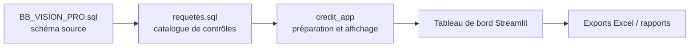

# Perfect Vision

Perfect Vision représente la source métier microfinance historique du projet.

La documentation de ce domaine s'appuie principalement sur :

- le schéma SQL Server `BB_VISION_PRO` ;
- le catalogue métier `data/modelisation/requetes.sql` ;
- les règles de contrôle interne Perfect Vision ;
- les modules d'analyse et d'affichage du tableau de bord ;
- les tests et limites documentés.

## Rôle métier

Perfect Vision permet de suivre les cycles de contrôle interne : opérations de dépôt/retrait, comptabilité, crédit, épargne, conformité, Money Provider, surveillance, portefeuille, risques et qualité des données.

## Rôle technique

Le projet exploite les données Perfect Vision à travers :

- un schéma SQL Server `BB_VISION_PRO` ;
- un catalogue de requêtes documentées ;
- des fonctions de préparation, de filtrage et d'affichage dans Streamlit ;
- des exports de tableaux de contrôle.

## Parcourir Perfect Vision

  <a class="bb-link-card" href="cycle_client.html">
    Cycle client
    Référentiel adhérents, identité, téléphone, comptes rattachés et qualité CRM.
  </a>
  <a class="bb-link-card" href="cycle_epargne.html">
    Cycle épargne
    Comptes ordinaires, DAT, produits d'épargne, mouvements, soldes et comptes dormants.
  </a>
  <a class="bb-link-card" href="cycle_credit.html">
    Cycle crédit
    Dossiers, prêts, cycles, échéanciers, remboursements, PAR, garanties et concentration.
  </a>
  <a class="bb-link-card" href="cycle_conformite.html">
    Conformité
    LBC-FT, alertes, déclarations, sanctions, qualité des données et reporting réglementaire.
  </a>
  <a class="bb-link-card" href="money_provider.html">
    Money Provider
    Opérations de monnaie électronique, agents, comptes provider, frais, commissions et rapprochements API.
  </a>
  <a class="bb-link-card" href="sources_schema_sql.html">
    Sources
    Schéma SQL, tables, vues et fichiers de référence.
  </a>
  <a class="bb-link-card" href="requetes_cycles_kpi.html">
    Requêtes et KPI
    Catalogue SQL, cycles, contrôles prioritaires et indicateurs.
  </a>
  <a class="bb-link-card" href="streamlit.html">
    Streamlit
    Navigation, filtres, cycles, cache, exports et interface.
  </a>
  <a class="bb-link-card" href="tests_limites.html">
    Tests et limites
    Scénarios protégés, précautions et zones non couvertes.
  </a>

## Diagramme simplifié

