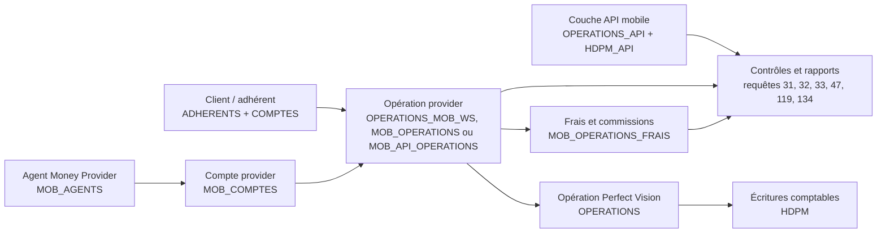
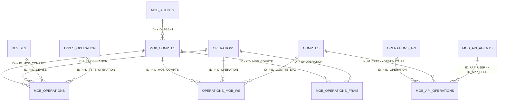

# Money Provider

Money Provider est le circuit Perfect Vision lié aux opérations de monnaie électronique : dépôt, retrait, transfert, commissions, rapprochement et contrôle des écritures.

Cette page sert à comprendre quelles tables interviennent, comment les lignes sont générées et quelles requêtes utiliser pour le suivi opérationnel.

## Lecture métier simple

Dans le circuit Money Provider, une opération part généralement d'un client ou d'un agent, passe par un compte provider, puis doit produire une opération et des écritures comptables contrôlables.

Le suivi doit répondre à cinq questions simples :

1. Qui a fait l'opération ?
2. Quel agent ou compte provider est intervenu ?
3. Quel montant, dans quelle devise, et dans quel sens ?
4. Est-ce que la commission ou les frais sont cohérents ?
5. Est-ce que l'opération est bien comptabilisée ?

## Circuit d'information

## Tables principales

| Famille | Tables | Lecture métier |
|---|---|---|
| Opérations provider | `OPERATIONS_MOB_WS`, `MOB_OPERATIONS`, `MOB_API_OPERATIONS` | Portent les opérations Money Provider observées côté Perfect Vision, y compris les opérations issues de l'API mobile. |
| Comptes provider | `MOB_COMPTES`, `COMPTES` | Relient le compte provider au compte comptable ou au compte support. |
| Agents | `MOB_AGENTS` | Identifie les agents Money Provider, leur agence et leurs rattachements. |
| Frais et commissions | `MOB_OPERATIONS_FRAIS`, `MOB_REPARTITION_FRAIS`, `MOB_TYPE_FRAIS`, `MOB_TYPE_FRAIS_DET`, `MOB_TYPE_REPARTITION` | Permettent de suivre les frais, commissions et parts agent. |
| Limites et plafonds | `MOB_PLAFONDS_LIMIT`, `MOB_NBRES_OPE_LIMIT` | Portent les plafonds et nombres d'opérations autorisés par agent, devise ou type d'opération. |
| Souscriptions | `MOB_SOUSCRIPTIONS` | Lie un adhérent, un téléphone et un agent mobile lorsqu'une souscription est enregistrée. |
| API mobile | `OPERATIONS_API`, `HDPM_API`, `MOB_API_OPERATIONS`, `MOB_API_CLIENTS`, `MOB_API_AGENTS`, `MOB_API_COMPTES` | Sert au suivi des opérations API/mobile et à leur rapprochement comptable. |

## Lecture relationnelle

Un agent Money Provider peut avoir un ou plusieurs comptes provider. Un compte provider peut porter plusieurs opérations. Une opération provider peut venir des anciennes tables mobiles (`OPERATIONS_MOB_WS`, `MOB_OPERATIONS`) ou de la couche API (`MOB_API_OPERATIONS`). Elle doit ensuite être rattachée à une opération Perfect Vision/API et, selon le cas, à des frais ou commissions.

### Clés utiles pour les informaticiens

| Table | Clé principale observée | Clés de liaison utiles |
|---|---|---|
| `MOB_AGENTS` | `ID` | `ID_COLLECTEUR`, `ID_GESTIONNAIRE` |
| `MOB_COMPTES` | `ID` | `ID_AGENT`, `ID_COMPTE`, `ID_DEVISE` |
| `OPERATIONS_MOB_WS` | `ID` | `ID_OPERATION`, `ID_COMPTE_EPG`, `ID_COMPTE`, `ID_MOB_COMPTE`, `ID_DEVISE`, `ID_TYPE_OPERATION` |
| `MOB_OPERATIONS` | `ID` | `ID_OPERATION`, `ID_MOB_COMPTE`, `ID_DEVISE`, `ID_TYPE_OPERATION` |
| `MOB_API_OPERATIONS` | `ID` | `ID_OPERATION`, `DATE_OPERATION`, `TYPE_OPERATION`, `SENS_OPERATION`, `NUMERO_COMPTE`, `DESTINATAIRE`, `DEVISE`, `ID_APP_USER` |
| `MOB_API_AGENTS` | `ID_APP_USER` | `NOM`, `PRENOMS`, `ID_AGENCE` |
| `MOB_OPERATIONS_FRAIS` | `ID` | `ID_OPERATION`, `ID_MOB_COMPTE`, `ID_COMPTE_EPG`, `ID_DEVISE`, `ID_TYPE_OPERATION` |
| `OPERATIONS_API` | `ID`, `CODE` | `NUM_TRANSACTION`, `ID_TYPE_OPERATION`, `ID_POINT_SERVICE` |
| `HDPM_API` | `ID`, `CODE` | `ID_OPERATION`, `NUM_TRANSACTION`, `ID_TYPE_OPERATION`, `ID_COMPTE`, `ID_DEVISE`, `SENS` |

## Requêtes utiles

| Priorité | N° | Export | Ce que la requête apporte | Commentaire |
|---:|---:|---|---|---|
| 1 | 134 | `134_cycle_money_provider_streamlit` | Produit le fichier détaillé Money Provider pour Streamlit. | Une ligne par opération mobile, y compris `MOB_API_OPERATIONS`, avec client, téléphone, agent, compte provider, reçu, frais, part agent, contrôle qualité et motif. |
| 2 | 119 | `119_cycle_money_provider_operations_money_provider_et_commissions_sur_la_periode` | Produit une synthèse des opérations, commissions, frais et contrôles. | Utile pour le suivi mensuel par source, type, devise, agent, client et compte provider. La requête utilise une recomposition ciblée des comptes clients et `OPTION (RECOMPILE)` pour éviter les plans SQL trop lourds. |
| 3 | 32 | `32_cycle_money_provider_operations_api_mobiles_sans_paire_debit_credit_equilibree_dans_hdpm_api` | Vérifie l'équilibre débit/crédit des opérations mobiles API. | À utiliser pour détecter les opérations mobiles mal comptabilisées ou incomplètes. |
| 4 | 31 | `31_cycle_money_provider_operations_api_sans_ecritures_hdpm_api_rattachees` | Identifie les opérations API actives sans écritures comptables API. | Une absence d'écriture doit être revue avec l'équipe informatique ou comptable. |
| 5 | 33 | `33_cycle_money_provider_operations_api_annulees_et_leurs_ecritures_hdpm_api` | Documente les opérations API annulées et leur impact comptable. | Utile pour vérifier que l'annulation ne laisse pas une écriture incohérente. |
| 6 | 47 | `47_cycle_money_provider_detail_mobile_banking_par_type_operation` | Détaille les opérations mobile banking par type d'opération. | Sert au reporting et à la lecture des volumes `MOB_DEPO` / `MOB_RETR`. |

## Contrôles à prioriser

| Contrôle | Pourquoi c'est important |
|---|---|
| Opération sans reçu | Le reçu est une référence essentielle pour retrouver la preuve opérationnelle. |
| Client non identifié | L'opération devient difficile à expliquer ou à rapprocher avec l'activité client. |
| Agent non identifié | Le suivi de responsabilité et de point de service devient fragile. |
| Compte provider non identifié | Le solde et le rapprochement provider deviennent difficiles à contrôler. |
| Opération sans écritures comptables | Risque d'opération enregistrée sans impact comptable exploitable. |
| Débit/crédit déséquilibré | Risque d'anomalie comptable ou de mouvement incomplet. |
| Commission ou frais non cohérents | Impact direct sur les revenus, la part agent et le reporting. |

## Règles de lecture

- Ne jamais additionner CDF et USD dans un même montant sans conversion officielle documentée.
- Distinguer les opérations back-office/provider (`OPERATIONS_MOB_WS`, `MOB_OPERATIONS`) des opérations API (`MOB_API_OPERATIONS`, `OPERATIONS_API`, `HDPM_API`).
- Pour les analyses mobile banking réglementaires, les codes les plus utilisés sont `MOB_DEPO` et `MOB_RETR`.
- Une opération classée `A verifier` n'est pas forcément une fraude : c'est un signal de revue.
- Les colonnes techniques restent nécessaires pour les jointures, mais les exports destinés aux utilisateurs doivent privilégier client, téléphone, agent, compte, devise, date, montant, reçu, statut et motif.

## Limites connues

Certaines jointures API ne sont pas matérialisées par des clés étrangères dans le schéma. Dans les requêtes du catalogue, le rapprochement entre opérations API et écritures API s'appuie notamment sur les références d'opération et de transaction disponibles (`CODE`, `ID_OPERATION`, `NUM_TRANSACTION`). Ces règles doivent être confirmées par les tests sur la base ciblée avant de présenter les chiffres comme définitivement validés.
