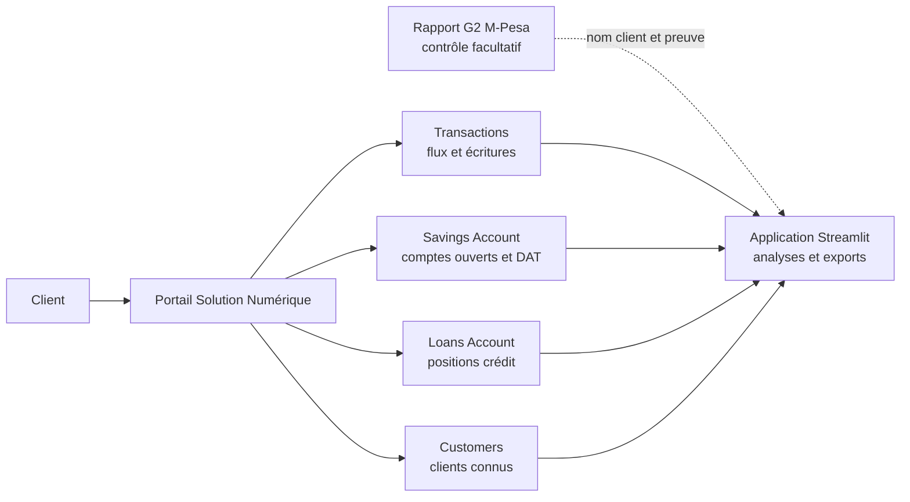
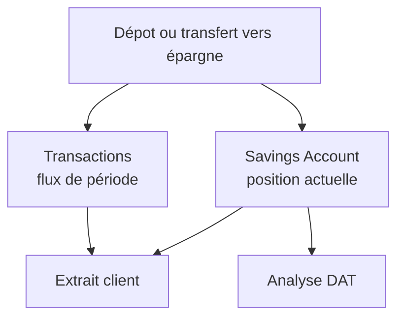
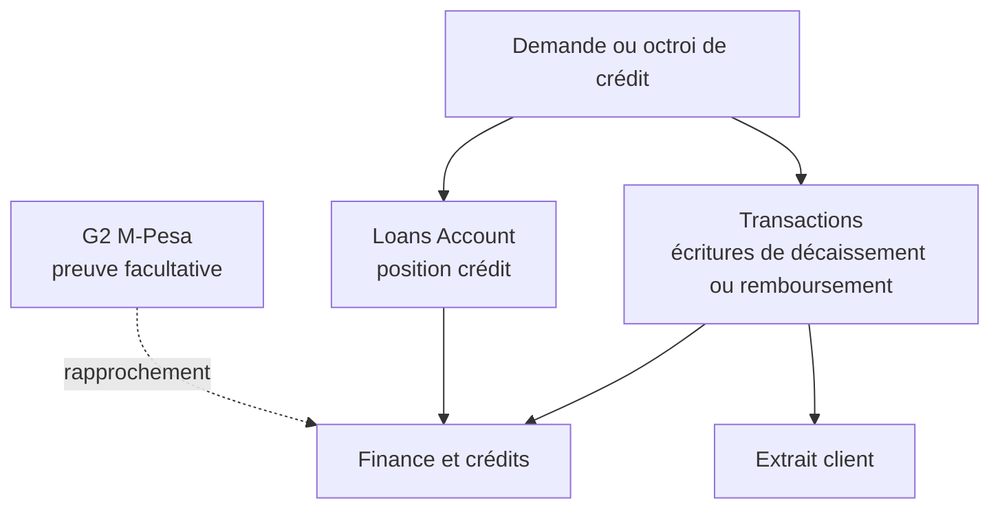

# Circuit d'information de la Solution Numérique

Cette page explique comment lire les fichiers de la Solution Numérique lorsqu'une opération se produit. L'idée n'est pas seulement de savoir quel fichier charger, mais de comprendre **quand une ligne apparaît, pourquoi elle apparaît et comment elle est utilisée dans les analyses**.

Les fichiers de test utilisés pour vérifier ces circuits sont conservés localement dans :

- `Documents\Test Controle interne\Test Solution M_PESA`
- `Documents\Test Controle interne\bdd Solution M_PESA`
- `Downloads\Test Benjamin`

Aucune donnée individuelle réelle n'est publiée dans cette documentation.

## Vue d'ensemble



## Règle centrale

La Solution Numérique est la source financière principale. Le Solution Numérique/G2 sert à enrichir l'identité du client et à contrôler les écritures, mais il ne remplace jamais les montants, dates, soldes, DAT, crédits ou remboursements issus de la Solution Numérique.

## 1. Lorsqu'il y a une transaction

Une transaction produit des lignes dans `Transactions`. Ce fichier contient des écritures techniques. Il ne faut donc pas confondre une ligne brute avec une opération client.

### Fichier principal

| Fichier | Quand il intervient | Pourquoi |
|---|---|---|
| `Transactions` | À chaque mouvement financier ou écriture liée à une opération | Reconstituer les flux, le détail du relevé, les balances et les journaux |
| `G2` | Si le rapport est disponible | Vérifier la référence, le statut, l'heure et enrichir le nom client |
| `Savings Account` | Si la transaction touche un compte ouvert ou un DAT | Lire la position actuelle du compte |
| `Loans Account` | Si la transaction touche un crédit ou un remboursement | Lire la position actuelle du prêt |

### Colonnes importantes

| Colonne anglaise | Nom français recommandé | Rôle |
|---|---|---|
| `id` | identifiant_ligne | Identifiant technique de la ligne |
| `customer_id` | identifiant_client | Client concerné dans la Solution Numérique |
| `msisdn1` | telephone_client | Numéro de téléphone du client |
| `account_type` | type_de_compte | Nature comptable de la ligne : compte ouvert, DAT, prêt, principal, portefeuille |
| `reference_id` | reference_metier | Référence interne du prêt, compte ou opération métier |
| `ref_no` | reference_operation | Référence opérationnelle rapprochable avec `Receipt No.` G2 |
| `currency_code` | devise | Devise de la ligne : CDF ou USD |
| `dr` | debit_sortie | Montant sorti du compte ou du sous-registre concerné |
| `cr` | credit_entree | Montant entré dans le compte ou le sous-registre concerné |
| `bal_before` | solde_avant | Solde avant écriture |
| `bal_after` | solde_apres | Solde après écriture |
| `description` | description_operation | Libellé métier de l'opération |
| `created_at` | date_creation | Date et heure de création dans la Solution Numérique |

### Lecture métier

Pour un relevé bancaire client, le détail transactionnel doit rester centré sur le compte ouvert. Les lignes pertinentes sont principalement celles du compte courant d'épargne, avec `account_type` (type_de_compte) correspondant au compte ouvert, souvent `NORMAL SAVINGS` ou `MPESA ACCOUNT` selon le circuit.

Les opérations attendues dans le détail sont :

- dépôt ;
- retrait ;
- retrait de DAT avant échéance ;
- retour du montant principal du DAT ;
- entrée des intérêts DAT ;
- remboursement d'un crédit depuis le compte ouvert.

## 2. Lorsqu'il y a une épargne ou un DAT

L'épargne courante et les DAT sont lus à deux niveaux :

1. `Transactions` pour les flux de période ;
2. `Savings Account` pour la position actuelle.

### Circuit



### Fichier `Savings Account`

| Colonne anglaise | Nom français recommandé | Rôle |
|---|---|---|
| `savings_id` | identifiant_compte_epargne | Identifiant du compte d'épargne |
| `customer_id` | identifiant_client | Client propriétaire du compte |
| `msisdn1` | telephone_client | Numéro du client |
| `product_id` | identifiant_produit | Identifiant du produit |
| `product_name` | nom_produit | Nom du produit : épargne courante ou DAT |
| `product_description` | description_produit | Description du produit |
| `currency_code` | devise | Devise du compte |
| `balance` | solde | Solde actuel du compte |
| `status` | statut | Statut administratif du compte |
| `date_approved` | date_approbation | Date d'approbation du compte ou DAT |
| `date_activated` | date_activation | Date d'activation |
| `maturity_date` | date_echeance | Date d'échéance du DAT |
| `interest_earned` | interet_client | Intérêt acquis ou observé pour le client |
| `locked_balance` | solde_bloque | Montant bloqué, utile pour les DAT |
| `created_at` | date_creation | Date de création technique |
| `updated_at` | date_mise_a_jour | Date de dernière mise à jour |
| `is_interest_calculated` | interet_calcule | Indique si l'intérêt a été calculé |
| `last_interest_calculation_date` | date_dernier_calcul_interet | Dernière date de calcul d'intérêt |
| `next_interest_calculation_date` | date_prochain_calcul_interet | Prochaine date de calcul d'intérêt |

### Comment interpréter

- `Savings Account` donne une **photo actuelle** du compte.
- `Transactions` donne les **mouvements de la période**.
- Un seul fichier `Savings Account` ne suffit pas pour reconstruire toute l'évolution historique d'un solde.
- Les DAT sont généralement les lignes dont `product_name` (nom_produit) ou `product_description` (description_produit) indique un produit de type compte bloqué ou `FIXED SAVINGS`.

## 3. Lorsqu'il y a un crédit

Un crédit peut générer plusieurs lignes dans `Transactions`, mais la position du prêt se lit dans `Loans Account`.

### Circuit



### Fichier `Loans Account`

| Colonne anglaise | Nom français recommandé | Rôle |
|---|---|---|
| `loan_id` | identifiant_credit | Référence du prêt |
| `customer_id` | identifiant_client | Client concerné |
| `customer` | nom_client | Nom client si disponible |
| `currency_code` | devise | Devise du crédit |
| `loan_product_id` | identifiant_produit_credit | Produit crédit |
| `savings_account_id` | identifiant_compte_epargne_lie | Compte épargne lié au prêt, si disponible |
| `loan_amount` | montant_credit | Montant brut accordé |
| `loan_balance` | solde_credit | Solde actuel du crédit |
| `amount_paid` | montant_paye | Montant déjà payé |
| `outstanding_principle` | capital_restant_du | Capital restant dû |
| `outstanding_interest` | interet_restant_du | Intérêt restant dû |
| `outstanding_penalty_fees` | penalites_restantes | Pénalités restantes |
| `interest_earned` | interet_acquis | Intérêt acquis |
| `status_name` | statut_credit | Statut du crédit |
| `due_date` | date_echeance | Date d'échéance |
| `last_repayment_date` | date_dernier_remboursement | Date du dernier remboursement |
| `created_at` | date_creation | Date de création du prêt |
| `updated_at` | date_mise_a_jour | Date de mise à jour |
| `msisdn1` | telephone_client | Téléphone du client |

### Octroi de crédit

Pour un octroi, la Solution Numérique peut produire plusieurs écritures techniques dans `Transactions` :

- écriture du portefeuille prêt ;
- écriture du principal ;
- écriture du compte prêt ;
- écriture du compte M-Pesa ou compte ouvert selon le circuit ;
- lignes de frais ou intérêts prélevés.

Il ne faut donc pas additionner toutes les lignes brutes. L'analyse doit reconstituer l'événement canonique avec `reference_id` (reference_metier), `ref_no` (reference_operation), `created_at` (date_creation), `customer_id` (identifiant_client) et `currency_code` (devise).

### Remboursement de crédit

Un remboursement peut aussi produire plusieurs lignes :

- sortie du compte ouvert ;
- entrée dans le compte prêt ;
- ventilation entre capital, intérêt et pénalités ;
- éventuelles lignes techniques de portefeuille.

Dans l'extrait client, le remboursement est affiché s'il touche le compte ouvert. Dans Finance et Crédits, il est analysé comme remboursement observé, avec séparation du capital, des intérêts et des pénalités lorsque les lignes permettent cette ventilation.

## 4. Rôle du Solution Numérique/G2

G2 intervient après l'opération, comme preuve ou contrôle.

| Colonne G2 anglaise | Nom français recommandé | Rôle |
|---|---|---|
| `Receipt No.` | numero_recu_g2 | Référence G2 à rapprocher avec `ref_no` (reference_operation) |
| `Completion Time` | date_finalisation_g2 | Date/heure de finalisation G2 |
| `Initiation Time` | date_initiation_g2 | Date/heure d'initiation G2 |
| `Details` | details_rapport | Libellé G2 |
| `Transaction Status` | statut_transaction | Statut G2 |
| `Currency` | devise | Devise |
| `Paid In` | montant_entree | Montant entrant selon G2 |
| `Withdrawn` | montant_sortie | Montant sortant selon G2 |
| `Balance` | solde_g2 | Solde affiché dans G2 |
| `Reason Type` | type_raison | Type ou motif G2 |
| `Opposite Party` | contrepartie | Contrepartie, souvent utile pour le nom |
| `Linked Transaction ID` | transaction_liee | Référence liée |

G2 sert à répondre à trois questions :

1. La référence existe-t-elle aussi dans le relevé M-Pesa 
2. Le statut G2 est-il terminé ou en anomalie 
3. Le nom ou la contrepartie peut-il enrichir l'identité client 

G2 ne répond pas à la question : “quel est le montant financier officiel à comptabiliser dans la Solution Numérique ” Cette réponse vient des fichiers Solution Numérique.

## 5. Pourquoi plusieurs lignes pour une seule opération 

La Solution Numérique fonctionne comme un sous-registre comptable. Une opération métier peut toucher plusieurs poches :

- compte ouvert ;
- compte bloqué ;
- portefeuille prêt ;
- principal ;
- intérêts ;
- pénalités ;
- compte M-Pesa.

Chaque poche peut produire sa propre ligne dans `Transactions`. L'application doit donc :

- conserver les lignes brutes pour audit ;
- regrouper les lignes en événements canoniques pour les KPI ;
- afficher seulement les lignes utiles au relevé client ;
- éviter de compter deux fois les lignes miroir ;
- garder CDF et USD séparés.

## 6. Résumé pratique

| Question métier | Fichier prioritaire | Pourquoi |
|---|---|---|
| Quel mouvement a eu lieu sur la période | `Transactions` | C'est le journal des flux |
| Quel est le compte ouvert ou DAT actuel | `Savings Account` | C'est la position actuelle de l'épargne |
| Quel est l'encours ou statut du crédit | `Loans Account` | C'est la position actuelle du prêt |
| Combien de clients sont connus | `Customers` | C'est le référentiel client Solution Numérique |
| Quel est le nom client ou la preuve M-Pesa | `G2` | C'est le contrôle facultatif et l'enrichissement |
| Le client existe-t-il aussi dans Perfect | `Clients_Perfect` | C'est le croisement analytique facultatif |

## 7. Cas pédagogiques issus du scénario de test

Les exemples ci-dessous sont inspirés du scénario `Test Benjamin`, mais les identifiants personnels sont anonymisés. Le client est noté `Client A`, son téléphone est masqué, et les références sont remplacées par des références pédagogiques.

### Cas 1 - Souscription d'un DAT de 10 USD

#### Ce que fait le client

Le client place 10 USD dans un compte bloqué pendant un mois.

#### Ce que la Solution Numérique génère

| Fichier | Lignes générées | Lecture |
|---|---:|---|
| `Transactions` | 2 lignes | Mouvement de sortie du compte M-Pesa interne et entrée dans le DAT |
| `Savings Account` | 1 ligne | Position actuelle du DAT |
| `G2 1441` | 1 ligne | Preuve M-Pesa d'entrée, si le rapport est chargé |

#### Lignes attendues dans `Transactions`

| `account_type` / type_de_compte | `dr` / debit_sortie | `cr` / credit_entree | `description` / description_operation | Lecture |
|---|---:|---:|---|---|
| `MPESA ACCOUNT` / compte_m_pesa | 10 | 0 | M-Pesa Compte | Sortie technique depuis le compte M-Pesa interne |
| `FIXED SAVINGS` / compte_bloque | 0 | 10 | Depot Bloque | Entrée dans le compte bloqué DAT |

Colonnes de liaison :

- `reference_id` / reference_metier : identifiant du DAT, également retrouvé dans `Savings Account.savings_id` / identifiant_compte_epargne.
- `ref_no` / reference_operation : référence opérationnelle rapprochable avec `G2.Receipt No.` / numero_recu_g2.
- `created_at` / date_creation : date et heure de l'opération dans la Solution Numérique.

#### Lecture correcte

- Dans `DAT`, le montant de 10 USD vient de `Savings Account.balance` / solde ou `locked_balance` / solde_bloque.
- Dans l'extrait client, le DAT en cours est affiché dans un bloc séparé.
- Le dépôt DAT ne doit pas être mélangé avec le solde du compte ouvert.

### Cas 2 - Octroi d'un crédit de 5 USD avec intérêt prélevé

#### Ce que fait le client

Le client obtient un crédit brut de 5 USD. L'intérêt de 7 % est prélevé immédiatement, donc le net versé est de 4,65 USD.

#### Ce que la Solution Numérique génère

| Fichier | Lignes générées | Lecture |
|---|---:|---|
| `Transactions` | 12 lignes d'octroi | Ventilation comptable du prêt, du principal, du compte prêt, du compte M-Pesa et des intérêts |
| `Loans Account` | 1 ligne | Position du crédit |
| `G2 15558` | 1 ligne | Preuve de sortie M-Pesa du net versé, si le rapport est chargé |

#### Pourquoi 12 lignes 

Une seule opération de crédit touche plusieurs sous-registres. Les lignes brutes ne doivent donc pas être additionnées comme si elles étaient 12 crédits.

Exemples de poches touchées :

| `account_type` / type_de_compte | Rôle |
|---|---|
| `PRINCIPLE` / principal | Capital du crédit |
| `LOAN ACCOUNT` / compte_pret | Compte de prêt |
| `INTEREST EARNED` / interet_acquis | Intérêt prélevé ou constaté |
| `LOAN PORTFOLIO` / portefeuille_credit | Portefeuille de crédit |
| `LOAN AMOUNT A/C` / compte_montant_pret | Montant du prêt |
| `MPESA ACCOUNT` / compte_m_pesa | Net versé ou frais selon la ligne |
| `BISOU COLLECTION` / collecte_bisou | Part de revenu Bisou Bisou |
| `VODA COLLECTION A/C` / collecte_vodacom | Part de revenu Vodacom |

#### Lecture correcte

Pour l'analyse crédit :

- `Loans Account.loan_amount` / montant_credit = 5 USD ;
- `Loans Account.loan_id` / identifiant_credit est la référence du prêt ;
- `Loans Account.status_name` / statut_credit donne le statut du prêt.

Pour l'extrait client :

- afficher le net versé : 4,65 USD ;
- expliquer le brut : 5,00 USD ;
- expliquer l'intérêt prélevé : 0,35 USD ;
- ne pas additionner les 12 lignes de `Transactions`.

Libellé recommandé :

```text
Prêt brut : 5,00 USD - intérêt prélevé : 0,35 USD (7 %) - net versé : 4,65 USD
```

### Cas 3 - Dépôt de 5 USD sur le compte ouvert

#### Ce que fait le client

Le client dépose 5 USD sur son compte d'épargne ouvert.

#### Ce que la Solution Numérique génère

| Fichier | Lignes générées | Lecture |
|---|---:|---|
| `Transactions` | 2 lignes | Mouvement M-Pesa interne et entrée dans le compte ouvert |
| `G2 1441` | 1 ligne | Preuve d'entrée M-Pesa, si le rapport est chargé |
| `Savings Account` | Position mise à jour | Solde du compte ouvert dans la photo actuelle |

#### Lignes attendues dans `Transactions`

| `account_type` / type_de_compte | `dr` / debit_sortie | `cr` / credit_entree | `description` / description_operation | Lecture |
|---|---:|---:|---|---|
| `MPESA ACCOUNT` / compte_m_pesa | 5 | 0 | M-Pesa Depot | Sortie technique du compte M-Pesa interne |
| `NORMAL SAVINGS` / compte_ouvert | 0 | 5 | Epargne depot | Entrée sur le compte ouvert du client |

#### Lecture correcte

- Dans le relevé bancaire, la ligne utile est `NORMAL SAVINGS` / compte_ouvert.
- `cr` / credit_entree devient `Entrée`.
- `bal_after` / solde_apres permet de suivre le solde du détail transactionnel.
- G2 peut confirmer `Receipt No.` / numero_recu_g2, mais ne remplace pas le montant de `Transactions`.

### Cas 4 - Remboursement de crédit depuis le compte ouvert

#### Ce que fait le client

Le client rembourse 5 USD en utilisant son compte ouvert.

#### Ce que la Solution Numérique génère

| Fichier | Lignes générées | Lecture |
|---|---:|---|
| `Transactions` | 6 lignes | Sortie du compte ouvert et ventilation du remboursement |
| `Loans Account` | Position crédit mise à jour | Montant payé, solde crédit et statut |
| `G2` | Peut être absent | Le remboursement interne peut ne pas produire de message M-Pesa client |

#### Lignes observables dans `Transactions`

| `account_type` / type_de_compte | `dr` / debit_sortie | `cr` / credit_entree | Lecture |
|---|---:|---:|---|
| `NORMAL SAVINGS` / compte_ouvert | 5 | 0 | Sortie du compte ouvert du client |
| `PRINCIPLE` / principal | 0 | 5 | Remboursement du principal |
| `LOAN PORTFOLIO` / portefeuille_credit | 5 | 0 | Ajustement portefeuille prêt |
| `MPESA ACCOUNT` / compte_m_pesa | 5 | 0 | Ligne technique de remboursement M-Pesa |
| `FIXED SAVINGS` / compte_bloque | 5 | 0 | Ligne technique à ne pas interpréter comme retrait DAT automatique |

#### Lecture correcte

- Dans le détail du relevé, la sortie pertinente est la ligne `NORMAL SAVINGS` / compte_ouvert.
- Dans le bloc `Remboursements observés`, l'opération est conservée comme remboursement de crédit.
- Il ne faut pas confondre la ligne `FIXED SAVINGS` / compte_bloque avec un retrait réel du DAT si la logique métier ne le confirme pas.
- Le regroupement ne doit pas se faire uniquement avec `reference_id` / reference_metier, car le même identifiant de crédit peut apparaître dans l'octroi et le remboursement.

### Cas 5 - Situation finale du scénario

Dans le scénario de test, après les opérations :

| Élément | Lecture attendue |
|---|---:|
| Compte ouvert | 0 USD |
| Compte bloqué DAT | 10 USD |

Cette situation confirme une règle importante : le relevé bancaire ne doit pas afficher un solde de 10,35 USD simplement parce que le net crédit et l'intérêt ont été observés. Le compte ouvert suit uniquement les mouvements du compte ouvert, tandis que le compte bloqué DAT reste une position séparée issue de `Savings Account`.

## 8. Méthode de diagnostic lorsqu'un chiffre ne semble pas correct

Lorsqu'un solde, une entrée, une sortie ou un remboursement ne semble pas correct, suivre l'ordre suivant :

1. Rechercher `customer_id` / identifiant_client et `msisdn1` / telephone_client dans `Transactions`.
2. Regrouper par `ref_no` / reference_operation lorsque la référence existe.
3. Si `ref_no` / reference_operation est vide, utiliser prudemment `reference_id` / reference_metier avec `created_at` / date_creation, `currency_code` / devise et `account_type` / type_de_compte.
4. Vérifier la position actuelle dans `Savings Account` avec `savings_id` / identifiant_compte_epargne.
5. Vérifier la position crédit dans `Loans Account` avec `loan_id` / identifiant_credit.
6. Utiliser G2 seulement pour contrôler `Receipt No.` / numero_recu_g2, le statut et éventuellement le nom.
7. Ne jamais additionner CDF et USD.
8. Ne jamais additionner toutes les lignes techniques d'une opération sans regroupement métier.
