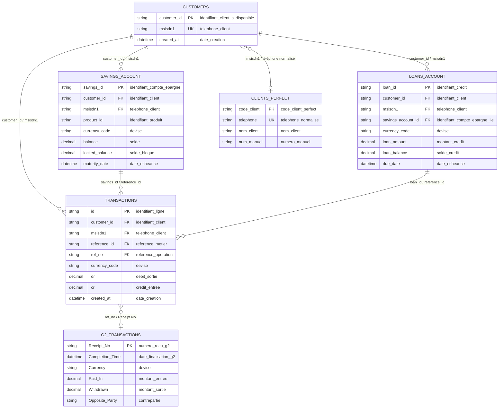
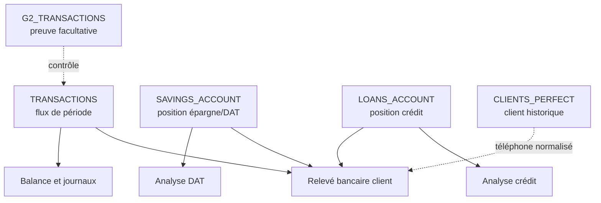

# Solution Numérique — Modèle relationnel des fichiers

La Solution Numérique est alimentée par des fichiers Excel. Même si ce ne sont pas des tables SQL, il est utile de les lire comme un petit modèle relationnel : chaque fichier a un grain, une clé et des relations avec les autres fichiers.

## Vue relationnelle



## Narratif métier

Le modèle peut se lire comme une histoire. Tout commence par un client identifié dans `CUSTOMERS` (clients). Ce fichier donne la base : un numéro de téléphone `msisdn1` (téléphone client), parfois un `customer_id` (identifiant client), et la date à laquelle le client est connu dans le portail numérique.

Quand ce client fait une opération, le portail ne crée pas seulement une ligne “simple”. Il écrit l'opération dans `TRANSACTIONS` (transactions). Ce fichier est le journal des mouvements : il dit quelle poche comptable est touchée avec `account_type` (type de compte), quelle devise est utilisée avec `currency_code` (devise), quel montant entre avec `cr` (crédit / entrée), quel montant sort avec `dr` (débit / sortie), et quel est le solde avant/après avec `bal_before` (solde avant) et `bal_after` (solde après).

Ensuite, deux fichiers donnent la position actuelle du client :

- `SAVINGS_ACCOUNT` (comptes d'épargne) indique les comptes ouverts, les comptes bloqués/DAT, les soldes et les échéances ;
- `LOANS_ACCOUNT` (comptes de crédit) indique les crédits accordés, les encours, les montants remboursés et les échéances.

Enfin, `G2_TRANSACTIONS` (transactions G2 M-Pesa) n'est pas la source des montants. Il sert à contrôler que la référence M-Pesa existe, que l'opération a bien abouti, et parfois à enrichir le nom du client. La relation se fait surtout par `ref_no` (référence opération) côté `TRANSACTIONS` et `Receipt No.` (numéro reçu G2) côté G2.

Le pont avec Perfect Vision se fait par le téléphone normalisé : `msisdn1` (téléphone client) côté Solution Numérique et le téléphone client côté Perfect Vision. C'est ce lien qui permet, à terme, de construire une vue client 360.

## Comment lire une opération

### 1. Dépôt sur compte ouvert

Le client dépose de l'argent sur son compte ouvert.

Lecture attendue :

1. `TRANSACTIONS` (transactions) montre les écritures de l'opération.
2. La ligne utile au relevé client est celle où `account_type` (type de compte) correspond au compte ouvert, par exemple `NORMAL SAVINGS` ou une valeur équivalente.
3. `cr` (crédit / entrée) représente le montant qui entre dans le compte ouvert.
4. `bal_after` (solde après) permet de lire le solde après dépôt.
5. `SAVINGS_ACCOUNT` (comptes d'épargne) confirme la position actuelle du compte.
6. G2 peut confirmer la référence, mais ne remplace pas les montants de `TRANSACTIONS`.

### 2. Retrait depuis le compte ouvert

Le client retire de l'argent depuis son compte ouvert.

Lecture attendue :

1. `TRANSACTIONS` (transactions) contient la ligne du compte ouvert.
2. `dr` (débit / sortie) représente le montant retiré.
3. `bal_after` (solde après) donne le solde après retrait.
4. Si le retrait est passé par M-Pesa, G2 peut servir de preuve avec `Receipt No.` (numéro reçu G2).

### 3. Souscription d'un DAT

Le client bloque une somme sur un dépôt à terme.

Lecture attendue :

1. `TRANSACTIONS` (transactions) montre le flux de souscription.
2. `SAVINGS_ACCOUNT` (comptes d'épargne) devient la source importante pour connaître la position du DAT.
3. `savings_id` (identifiant compte épargne) permet de reconnaître le compte bloqué.
4. `balance` (solde) ou `locked_balance` (solde bloqué) donne le capital bloqué.
5. `maturity_date` (date d'échéance) indique quand le DAT arrive à terme.
6. `interest_earned` (intérêt client) permet de suivre l'intérêt observé lorsque la donnée est disponible.

Le DAT ne doit pas être mélangé avec le compte ouvert. Dans un relevé bancaire professionnel, il doit apparaître comme une position séparée.

### 4. Octroi d'un crédit

Le client reçoit un crédit.

Lecture attendue :

1. `LOANS_ACCOUNT` (comptes de crédit) donne la position du crédit : `loan_id` (identifiant crédit), `loan_amount` (montant crédit), `loan_balance` (solde crédit), `status_name` (statut crédit).
2. `TRANSACTIONS` (transactions) peut contenir plusieurs lignes pour un seul crédit, car le portail ventile l'opération entre principal, compte prêt, portefeuille crédit, intérêts, frais et compte M-Pesa.
3. Il ne faut pas additionner toutes les lignes techniques.
4. Pour l'analyse crédit, le montant accordé se lit dans `loan_amount` (montant crédit).
5. Pour le relevé client, seules les lignes qui touchent réellement le compte ouvert doivent apparaître dans le détail transactionnel.

### 5. Remboursement de crédit

Le client rembourse un crédit depuis son compte ouvert.

Lecture attendue :

1. `TRANSACTIONS` (transactions) montre la sortie du compte ouvert et les lignes de ventilation du remboursement.
2. La ligne pertinente du relevé bancaire est celle qui touche le compte ouvert.
3. `LOANS_ACCOUNT` (comptes de crédit) confirme la position mise à jour : `amount_paid` (montant payé), `loan_balance` (solde crédit), `outstanding_principle` (capital restant dû), `outstanding_interest` (intérêt restant dû).
4. Le remboursement doit être analysé comme un événement financier, mais sans compter deux fois les lignes miroir.

## Chemin de lecture recommandé

Pour analyser un client, suivre toujours cet ordre :

1. Identifier le client dans `CUSTOMERS` (clients) avec `msisdn1` (téléphone client) et `customer_id` (identifiant client).
2. Lire les mouvements de période dans `TRANSACTIONS` (transactions).
3. Lire les positions actuelles dans `SAVINGS_ACCOUNT` (comptes d'épargne) et `LOANS_ACCOUNT` (comptes de crédit).
4. Utiliser G2 uniquement comme contrôle ou enrichissement.
5. Rapprocher avec Perfect Vision par téléphone normalisé.
6. Garder les devises séparées.

## Tables logiques

| Table logique | Fichier Excel | Grain | Clés principales |
|---|---|---|---|
| `CUSTOMERS` | `Customers` | Un client connu par le portail | `msisdn1`, `customer_id` si disponible |
| `TRANSACTIONS` | `Transactions` | Une écriture transactionnelle | `id`, `customer_id`, `reference_id`, `ref_no`, `created_at` |
| `SAVINGS_ACCOUNT` | `Savings Account` | Une position de compte ouvert ou DAT | `savings_id`, `customer_id`, `msisdn1`, `currency_code` |
| `LOANS_ACCOUNT` | `Loans Account` | Une position de crédit | `loan_id`, `customer_id`, `msisdn1`, `currency_code` |
| `G2_TRANSACTIONS` | `ORG_1441`, `ORG_15558` | Une transaction M-Pesa G2 | `Receipt No.`, `Completion Time`, `Opposite Party` |
| `CLIENTS_PERFECT` | Export Perfect Vision facultatif | Un client Perfect Vision | téléphone normalisé, code client |

## Attributs de clés primaires et secondaires

Dans une vraie base de données, une clé primaire identifie une ligne de manière unique, tandis qu'une clé étrangère sert à relier une table à une autre. Dans les fichiers Excel, ces clés sont **logiques** : elles ne sont pas imposées par un moteur SQL, mais elles servent de repères pour les rapprochements.

| Table logique | Clé primaire logique | Clés secondaires / étrangères logiques | Commentaire |
|---|---|---|---|
| `CUSTOMERS` | `customer_id` (identifiant_client), si présent ; sinon `msisdn1` (telephone_client) devient la clé pratique | `msisdn1` (telephone_client) | Le fichier `Customers` ne contient parfois que `msisdn1`; dans ce cas le téléphone normalisé devient la clé de rapprochement. |
| `TRANSACTIONS` | `id` (identifiant_ligne) | `customer_id` (identifiant_client), `msisdn1` (telephone_client), `reference_id` (reference_metier), `ref_no` (reference_operation), `currency_code` (devise) | C'est le journal des écritures. `reference_id` rapproche avec `savings_id` ou `loan_id`; `ref_no` rapproche avec G2. |
| `SAVINGS_ACCOUNT` | `savings_id` (identifiant_compte_epargne) | `customer_id` (identifiant_client), `msisdn1` (telephone_client), `product_id` (identifiant_produit), `currency_code` (devise) | Un client peut avoir plusieurs comptes ouverts ou DAT. |
| `LOANS_ACCOUNT` | `loan_id` (identifiant_credit) | `customer_id` (identifiant_client), `msisdn1` (telephone_client), `savings_account_id` (identifiant_compte_epargne_lie), `currency_code` (devise) | Un client peut avoir plusieurs crédits ; le champ `savings_account_id` peut aider à rapprocher le prêt avec le compte d'épargne lié. |
| `G2_TRANSACTIONS` | `Receipt No.` (numero_recu_g2) | `Completion Time` (date_finalisation_g2), `Currency` (devise), `Opposite Party` (contrepartie), `Linked Transaction ID` (transaction_liee) | G2 sert de preuve et d'enrichissement, surtout par correspondance `Receipt No.` ↔ `ref_no`. |
| `CLIENTS_PERFECT` | `code_client` (code_client_perfect) ou `num_manuel` (numero_manuel) selon l'export | `telephone` (telephone_normalise), nom/prénoms | Source facultative pour relier le client numérique au client Perfect Vision. |

### Relations par clés

| Relation | Clé côté parent | Clé côté enfant | Cardinalité |
|---|---|---|---|
| Client vers transactions | `CUSTOMERS.customer_id` ou `CUSTOMERS.msisdn1` | `TRANSACTIONS.customer_id` ou `TRANSACTIONS.msisdn1` | 1 → n |
| Client vers comptes d'épargne | `CUSTOMERS.customer_id` ou `CUSTOMERS.msisdn1` | `SAVINGS_ACCOUNT.customer_id` ou `SAVINGS_ACCOUNT.msisdn1` | 1 → n |
| Client vers crédits | `CUSTOMERS.customer_id` ou `CUSTOMERS.msisdn1` | `LOANS_ACCOUNT.customer_id` ou `LOANS_ACCOUNT.msisdn1` | 1 → n |
| Compte épargne vers transactions | `SAVINGS_ACCOUNT.savings_id` | `TRANSACTIONS.reference_id` | 1 → n, lorsque la référence est disponible |
| Crédit vers transactions | `LOANS_ACCOUNT.loan_id` | `TRANSACTIONS.reference_id` | 1 → n |
| Transaction vers preuve G2 | `TRANSACTIONS.ref_no` | `G2_TRANSACTIONS.Receipt No.` | 0/1 → 1 |
| Client numérique vers Perfect Vision | `CUSTOMERS.msisdn1` | `CLIENTS_PERFECT.telephone` | 0/1 → 1 après normalisation |

## Lecture comme une base de données

Même si les sources sont des fichiers Excel, on peut raisonner comme avec une base relationnelle.

| Phrase métier | Lecture base de données | Exemple concret |
|---|---|---|
| Un client peut faire plusieurs transactions. | `CUSTOMERS` 1 → n `TRANSACTIONS` | Un même `customer_id` (identifiant client) peut apparaître sur plusieurs lignes de `TRANSACTIONS`. |
| Un client peut avoir plusieurs comptes d'épargne. | `CUSTOMERS` 1 → n `SAVINGS_ACCOUNT` | Un même `msisdn1` (téléphone client) peut avoir un compte ouvert et plusieurs DAT. |
| Un client peut avoir plusieurs crédits. | `CUSTOMERS` 1 → n `LOANS_ACCOUNT` | Un même `customer_id` peut avoir plusieurs `loan_id` (identifiant crédit). |
| Un compte d'épargne peut générer plusieurs écritures. | `SAVINGS_ACCOUNT` 1 → n `TRANSACTIONS` | Un `savings_id` (identifiant compte épargne) peut être retrouvé dans `reference_id` (référence métier). |
| Un crédit peut générer plusieurs écritures. | `LOANS_ACCOUNT` 1 → n `TRANSACTIONS` | Un `loan_id` (identifiant crédit) peut apparaître dans plusieurs lignes de `reference_id`. |
| Une transaction peut avoir une preuve G2. | `TRANSACTIONS` 0/1 → 1 `G2_TRANSACTIONS` | `ref_no` (référence opération) peut correspondre à `Receipt No.` (numéro reçu G2). |
| Un client numérique peut correspondre à un client Perfect Vision. | `CUSTOMERS` 0/1 → 1 `CLIENTS_PERFECT` | Le lien se fait par `msisdn1` (téléphone client) après normalisation. |

### Exemple narratif de cardinalité

Dans une base SQL, on dirait :

```text
Un client possède zéro, un ou plusieurs comptes.
Un compte appartient à un seul client.
Un compte peut avoir plusieurs mouvements.
Un mouvement appartient à une seule opération ou référence métier.
```

Dans la Solution Numérique, la même idée devient :

```text
Un client dans Customers peut avoir plusieurs lignes dans Savings Account.
Chaque ligne Savings Account représente un compte ouvert ou un DAT.
Chaque compte peut être touché par plusieurs lignes dans Transactions.
Les lignes Transactions expliquent les flux ; Savings Account explique la position actuelle.
```

Cette lecture évite une erreur fréquente : compter les lignes comme si elles avaient toutes le même sens. Une ligne client, une ligne compte, une ligne crédit et une ligne transaction n'ont pas le même niveau de détail.

## Contrat des relations

| Relation | Type | Pourquoi |
|---|---|---|
| `CUSTOMERS.customer_id` → `TRANSACTIONS.customer_id` | 1 à n | Retrouver les mouvements d'un client. |
| `CUSTOMERS.msisdn1` → `SAVINGS_ACCOUNT.msisdn1` | 1 à n | Retrouver les comptes ouverts et bloqués du client. |
| `CUSTOMERS.msisdn1` → `LOANS_ACCOUNT.msisdn1` | 1 à n | Retrouver les crédits du client. |
| `SAVINGS_ACCOUNT.savings_id` → `TRANSACTIONS.reference_id` | 1 à n, lorsque disponible | Rapprocher une opération avec un compte d'épargne ou DAT. |
| `LOANS_ACCOUNT.loan_id` → `TRANSACTIONS.reference_id` | 1 à n | Rapprocher l'octroi ou le remboursement avec un prêt. |
| `TRANSACTIONS.ref_no` → `G2_TRANSACTIONS.Receipt No.` | 0/1 à 1 | Contrôler la preuve M-Pesa et enrichir le nom. |
| `CUSTOMERS.msisdn1` → `CLIENTS_PERFECT.telephone` | 0/1 à 1 | Relier la Solution Numérique à Perfect Vision. |

## Colonnes anglaises et noms français

### `TRANSACTIONS`

| Colonne anglaise | Nom français | Usage |
|---|---|---|
| `id` | identifiant_ligne | Identifiant de l'écriture. |
| `customer_id` | identifiant_client | Client du portail numérique. |
| `msisdn1` | telephone_client | Téléphone du client. |
| `account_type` | type_de_compte | Poche comptable touchée. |
| `reference_id` | reference_metier | Référence métier du compte, DAT ou crédit. |
| `currency_code` | devise | Devise de l'écriture. |
| `dr` | debit_sortie | Sortie. |
| `cr` | credit_entree | Entrée. |
| `bal_before` | solde_avant | Solde avant. |
| `bal_after` | solde_apres | Solde après. |
| `ref_no` | reference_operation | Référence rapprochable avec G2. |
| `description` | description_operation | Libellé métier. |
| `created_at` | date_creation | Date et heure de l'écriture. |

### `SAVINGS_ACCOUNT`

| Colonne anglaise | Nom français | Usage |
|---|---|---|
| `savings_id` | identifiant_compte_epargne | Identifiant du compte. |
| `customer_id` | identifiant_client | Client propriétaire. |
| `msisdn1` | telephone_client | Téléphone du client. |
| `product_name` | nom_produit | Produit épargne ou DAT. |
| `currency_code` | devise | Devise du compte. |
| `balance` | solde | Solde actuel. |
| `locked_balance` | solde_bloque | Montant bloqué. |
| `maturity_date` | date_echeance | Échéance DAT. |
| `interest_earned` | interet_client | Intérêt observé. |
| `status` | statut | Statut du compte. |

### `LOANS_ACCOUNT`

| Colonne anglaise | Nom français | Usage |
|---|---|---|
| `loan_id` | identifiant_credit | Identifiant du prêt. |
| `loan_amount` | montant_credit | Montant brut accordé. |
| `loan_balance` | solde_credit | Encours crédit. |
| `amount_paid` | montant_paye | Montant payé. |
| `outstanding_principle` | capital_restant_du | Capital restant dû. |
| `outstanding_interest` | interet_restant_du | Intérêt restant dû. |
| `outstanding_penalty_fees` | penalites_restantes | Pénalités restantes. |
| `status_name` | statut_credit | Statut du crédit. |
| `due_date` | date_echeance | Échéance. |

## Lecture métier



## Règles de prudence

- `TRANSACTIONS` donne les flux ; `SAVINGS_ACCOUNT` et `LOANS_ACCOUNT` donnent des positions.
- Une opération métier peut générer plusieurs lignes techniques dans `TRANSACTIONS`.
- G2 ne remplace pas les montants de la Solution Numérique.
- Le rapprochement avec Perfect Vision se fait progressivement par téléphone normalisé.
- Aucun total financier ne doit mélanger CDF et USD.
