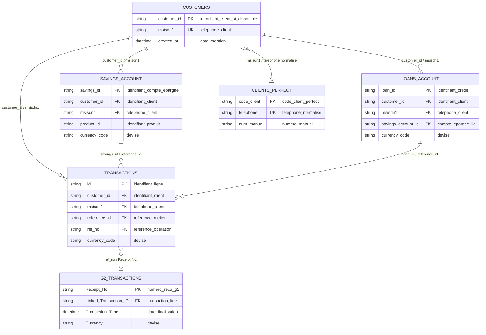

# Sources et contrats de données Solution Numérique

## Contrats de données

Les contrats de données sont décrits dans cette documentation et implémentés principalement dans :

- `credit_app/data_schema.py`
- `credit_app/services/mpesa_analysis.py`
- `credit_app/tabs/solution_mpesa.py`
- `tests/test_solution_mpesa_uploads.py`

La page [Modèle relationnel des fichiers](modele_relationnel.md) présente ces fichiers comme des tables logiques reliées par `customer_id`, `msisdn1`, `reference_id`, `loan_id`, `savings_id` et `ref_no`.

## Modèle logique simplifié

## Colonnes principales

### Transactions

Grain : une écriture transactionnelle.

Colonnes clés :

| Colonne anglaise | Nom français recommandé |
|---|---|
| `id` | identifiant_ligne |
| `customer_id` | identifiant_client |
| `msisdn1` | telephone_client |
| `account_type` | type_de_compte |
| `reference_id` | reference_metier |
| `currency_code` | devise |
| `dr` | debit_sortie |
| `cr` | credit_entree |
| `bal_before` | solde_avant |
| `bal_after` | solde_apres |
| `ref_no` | reference_operation |
| `description` | description_operation |
| `created_at` | date_creation |

### Savings Account

Grain : une position de compte d'épargne ouvert ou bloqué.

Colonnes clés :

| Colonne anglaise | Nom français recommandé |
|---|---|
| `savings_id` | identifiant_compte_epargne |
| `customer_id` | identifiant_client |
| `msisdn1` | telephone_client |
| `product_name` | nom_produit |
| `currency_code` | devise |
| `balance` | solde |
| `status` | statut |
| `date_activated` | date_activation |
| `maturity_date` | date_echeance |
| `interest_earned` | interet_client |
| `locked_balance` | solde_bloque |

### Loans Account

Grain : un prêt ou une position de prêt.

Colonnes clés :

| Colonne anglaise | Nom français recommandé |
|---|---|
| `loan_id` | identifiant_credit |
| `customer_id` | identifiant_client |
| `loan_amount` | montant_credit |
| `loan_balance` | solde_credit |
| `amount_paid` | montant_paye |
| `outstanding_principle` | capital_restant_du |
| `outstanding_interest` | interet_restant_du |
| `status_name` | statut_credit |
| `due_date` | date_echeance |
| `msisdn1` | telephone_client |

### Customers

Grain : un client connu par la Solution Numérique.

Colonnes clés :

| Colonne anglaise | Nom français recommandé |
|---|---|
| `msisdn1` | telephone_client |
| `created_at` | date_creation |

## Chargement multiple

`Savings Account` est la source complète. Les fichiers `Customers with Current Savings Account` et `Customers with Fixed Savings Account` sont des synthèses utiles mais ne doivent pas remplacer la source complète lorsqu'elle est disponible.
