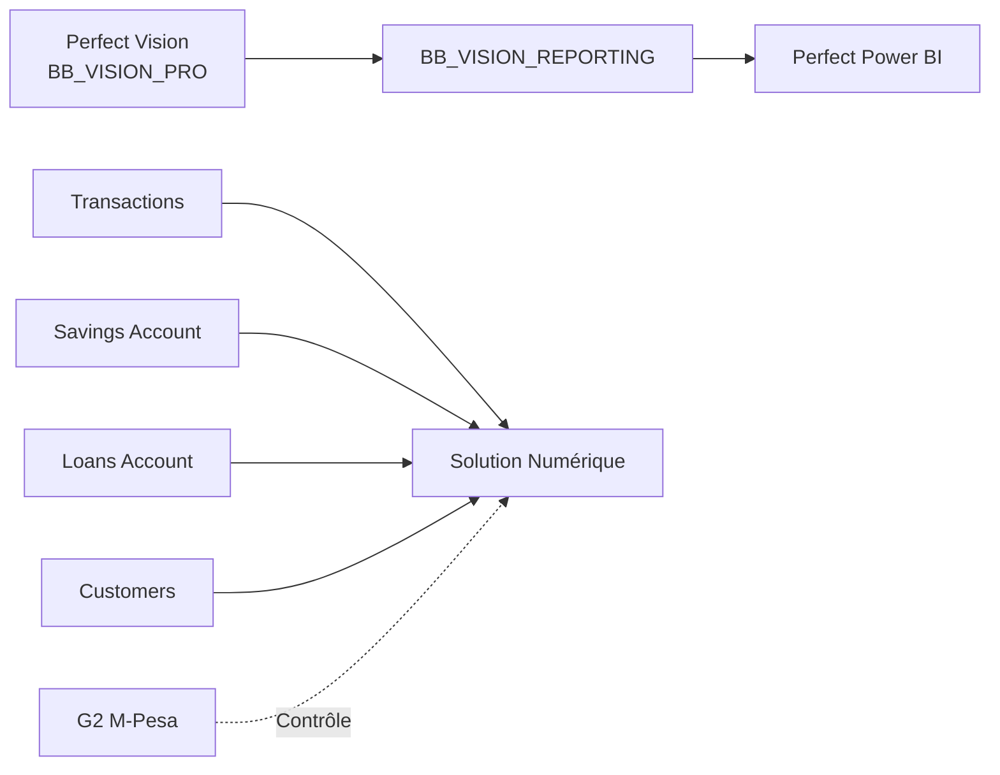

# Documentation Web IMF Bisou Bisou

## 0. Mission

Ce skill définit les règles obligatoires de création, d'alimentation, de mise à jour et de validation de la documentation web de la **MICROFINANCE BISOU BISOU**.

La documentation web doit permettre de comprendre le projet même lorsque le code a été écrit ou fortement modifié par Codex.

Principe fondamental :

> Le code ne doit jamais évoluer sans que la documentation permettant de le comprendre évolue avec lui.

La documentation doit être lisible par :

- la Direction ;
- les métiers ;
- le contrôle interne ;
- le Data Analyst ;
- les utilisateurs ;
- les développeurs ;
- toute personne reprenant le projet plus tard.

---

# 1. Architecture obligatoire : trois grandes parties

La documentation web doit obligatoirement être structurée autour de **trois parties principales**.

## Partie 1 — Perfect Vision

Source métier principale :

```text
C:\Users\Benjamin-mupanzi\Documents\GitHub\controle_interne\skills\perfect-vision
```

Cette partie documente notamment :

- la base `BB_VISION_PRO` ;
- les données Perfect Vision ;
- les tables ;
- les colonnes ;
- les relations ;
- les requêtes SQL ;
- les cycles de contrôle ;
- les analyses métier ;
- les exports ;
- les KPI issus directement de Perfect Vision ;
- le tableau de bord Streamlit Perfect Vision ;
- les contrôles internes réalisés à partir de Perfect Vision.

---

## Partie 2 — Perfect Power BI

Source métier principale :

```text
C:\Users\Benjamin-mupanzi\Documents\GitHub\controle_interne\skills\perfect-power-bi
```

Cette partie documente notamment :

- l'architecture Power BI ;
- `BB_VISION_REPORTING` ;
- les faits et dimensions ;
- le modèle en étoile ;
- les pages Power BI ;
- les KPI et mesures DAX ;
- Power Query ;
- PBIP / TMDL ;
- les relations ;
- les filtres ;
- le rafraîchissement ;
- la passerelle ;
- la sécurité ;
- la RLS ;
- les rapprochements Power BI ↔ SQL ;
- les règles de présentation Power BI ;
- le passage de Perfect Vision vers la couche décisionnelle.

Important :

Le skill `perfect-power-bi` dépend fonctionnellement de `perfect-vision`.

Pour documenter Perfect Power BI, lire également :

```text
skills\perfect-vision\SKILL.md
skills\perfect-vision\references\*
```

afin de conserver la traçabilité :

```text
Perfect Vision
      ↓
BB_VISION_REPORTING
      ↓
Power BI
```

---

## Partie 3 — Solution Numérique

Source métier principale :

```text
C:\Users\Benjamin-mupanzi\Documents\GitHub\controle_interne\skills\solution-mpesa
```

Cette partie documente notamment :

- Solution Numérique ;
- M-Pesa ;
- G2 ;
- importation ;
- contrôles ;
- extraits clients ;
- finance et comptabilité ;
- Clients ;
- Épargnes ;
- Crédits ;
- Perfect Client ;
- Statistiques ;
- Projections ;
- fichiers `Transactions` ;
- `Savings Account` ;
- `Loans Account` ;
- `Customers` ;
- rapports G2 1441 et 15558 ;
- rapprochements ;
- KPI ;
- exports ;
- limites des données.

---

# 2. Un seul site, pas trois sites concurrents

Il faut créer **un seul site de documentation IMF BB**.

Architecture conceptuelle :

```text
DOCUMENTATION IMF BISOU BISOU
│
├── PERFECT VISION
│
├── PERFECT POWER BI
│
└── SOLUTION NUMÉRIQUE
```

Ne jamais créer :

```text
site_perfect_vision/
site_power_bi/
site_solution_numerique/
```

comme trois systèmes de documentation indépendants si un site commun peut les réunir.

L'utilisateur doit pouvoir passer facilement d'une partie à l'autre.

---

# 3. Page d'accueil

La page d'accueil doit présenter immédiatement les trois domaines.

Exemple :

```text
MICROFINANCE BISOU BISOU
Documentation des solutions Data et Contrôle Interne

┌───────────────────────┐
│ Perfect Vision        │
│ Base métier / SQL     │
└───────────────────────┘

┌───────────────────────┐
│ Perfect Power BI      │
│ Reporting / KPI / BI  │
└───────────────────────┘

┌───────────────────────┐
│ Solution Numérique    │
│ M-Pesa / Clients /    │
│ Épargne / Crédit      │
└───────────────────────┘
```

La page d'accueil doit permettre de comprendre :

- le rôle de chaque solution ;
- les liens entre les trois ;
- où commencer selon le besoin.

---

# 4. Relation entre les trois parties

La documentation doit expliquer clairement que les trois parties n'ont pas le même rôle.

## Perfect Vision

```text
Système métier / base opérationnelle microfinance
```

Il représente notamment le cœur Perfect Vision et la base `BB_VISION_PRO`.

## Perfect Power BI

```text
Couche décisionnelle et de reporting
```

Elle consomme principalement des données issues de Perfect Vision via une couche de reporting telle que :

```text
BB_VISION_REPORTING
```

## Solution Numérique

```text
Solution analytique M-Pesa / digitale
```

Elle exploite principalement les exports de la Solution Numérique :

```text
Transactions
Savings Account
Loans Account
Customers
```

et les rapports G2 M-Pesa comme contrôle facultatif.

---

# 5. Diagramme global obligatoire

La documentation doit contenir un schéma global semblable à :



Le diagramme doit rester fidèle au fonctionnement réel.

---

# 6. Structure recommandée du site

Si aucune documentation web n'existe encore, utiliser :

```text
documentation_web/
```

Structure recommandée :

```text
documentation_web/
│
├── index.md
│
├── architecture_globale.md
│
│
├── perfect_vision/
│   ├── index.md
│   ├── presentation.md
│   ├── architecture.md
│   ├── sources.md
│   ├── schema_sql.md
│   ├── requetes.md
│   ├── cycles.md
│   ├── kpi.md
│   ├── controle_interne.md
│   ├── streamlit.md
│   ├── exports.md
│   ├── tests.md
│   └── limites.md
│
├── perfect_power_bi/
│   ├── index.md
│   ├── presentation.md
│   ├── architecture.md
│   ├── bb_vision_reporting.md
│   ├── modele_semantique.md
│   ├── faits_dimensions.md
│   ├── pages.md
│   ├── kpi_mesures_dax.md
│   ├── power_query.md
│   ├── pbip_tmdl.md
│   ├── securite_rls.md
│   ├── rafraichissement.md
│   ├── validation.md
│   ├── publication.md
│   ├── tests.md
│   └── limites.md
│
├── solution_numerique/
│   ├── index.md
│   ├── presentation.md
│   ├── architecture.md
│   ├── importation_controle.md
│   ├── extraits_clients.md
│   ├── finance_comptabilite.md
│   ├── clients.md
│   ├── epargnes.md
│   ├── credits.md
│   ├── mpesa_g2.md
│   ├── perfect_client.md
│   ├── statistiques.md
│   ├── projections.md
│   ├── sources.md
│   ├── contrats_donnees.md
│   ├── kpi.md
│   ├── tests.md
│   └── limites.md
│
├── transversal/
│   ├── glossaire.md
│   ├── conventions.md
│   ├── devises.md
│   ├── qualite_donnees.md
│   ├── securite_confidentialite.md
│   └── matrice_systemes.md
│
├── changelog/
│   ├── index.md
│   ├── perfect_vision.md
│   ├── perfect_power_bi.md
│   └── solution_numerique.md
│
└── faq.md
```

Cette structure peut être adaptée au projet existant.

Ne pas créer des pages vides uniquement pour respecter l'arborescence.

---

# 7. Navigation principale obligatoire

La navigation web doit présenter les trois domaines au premier niveau.

Exemple MkDocs :

```yaml
nav:
  - Accueil: index.md

  - Perfect Vision:
      - Présentation: perfect_vision/index.md
      - Architecture: perfect_vision/architecture.md
      - Sources: perfect_vision/sources.md
      - Schéma SQL: perfect_vision/schema_sql.md
      - Requêtes: perfect_vision/requetes.md
      - KPI: perfect_vision/kpi.md
      - Contrôle interne: perfect_vision/controle_interne.md
      - Streamlit: perfect_vision/streamlit.md
      - Tests: perfect_vision/tests.md
      - Limites: perfect_vision/limites.md

  - Perfect Power BI:
      - Présentation: perfect_power_bi/index.md
      - Architecture: perfect_power_bi/architecture.md
      - BB_VISION_REPORTING: perfect_power_bi/bb_vision_reporting.md
      - Modèle sémantique: perfect_power_bi/modele_semantique.md
      - Faits et dimensions: perfect_power_bi/faits_dimensions.md
      - Pages Power BI: perfect_power_bi/pages.md
      - KPI et DAX: perfect_power_bi/kpi_mesures_dax.md
      - Power Query: perfect_power_bi/power_query.md
      - PBIP / TMDL: perfect_power_bi/pbip_tmdl.md
      - Sécurité / RLS: perfect_power_bi/securite_rls.md
      - Rafraîchissement: perfect_power_bi/rafraichissement.md
      - Validation: perfect_power_bi/validation.md
      - Tests: perfect_power_bi/tests.md
      - Limites: perfect_power_bi/limites.md

  - Solution Numérique:
      - Présentation: solution_numerique/index.md
      - Architecture: solution_numerique/architecture.md
      - Importation et contrôle: solution_numerique/importation_controle.md
      - Extraits clients: solution_numerique/extraits_clients.md
      - Finance et comptabilité: solution_numerique/finance_comptabilite.md
      - Clients: solution_numerique/clients.md
      - Épargnes: solution_numerique/epargnes.md
      - Crédits: solution_numerique/credits.md
      - M-Pesa / G2: solution_numerique/mpesa_g2.md
      - Perfect Client: solution_numerique/perfect_client.md
      - Statistiques: solution_numerique/statistiques.md
      - Projections: solution_numerique/projections.md
      - Sources: solution_numerique/sources.md
      - KPI: solution_numerique/kpi.md
      - Tests: solution_numerique/tests.md
      - Limites: solution_numerique/limites.md

  - Références communes:
      - Glossaire: transversal/glossaire.md
      - Conventions: transversal/conventions.md
      - Qualité des données: transversal/qualite_donnees.md
      - Matrice des systèmes: transversal/matrice_systemes.md

  - Historique:
      - Perfect Vision: changelog/perfect_vision.md
      - Perfect Power BI: changelog/perfect_power_bi.md
      - Solution Numérique: changelog/solution_numerique.md

  - FAQ: faq.md
```

---

# 8. Règle absolue de séparation des sources

La documentation de chaque partie doit être alimentée en priorité par son propre skill.

## Perfect Vision

Lire :

```text
skills\perfect-vision\SKILL.md
skills\perfect-vision\references\*
```

## Perfect Power BI

Lire :

```text
skills\perfect-power-bi\SKILL.md
skills\perfect-power-bi\references\*
```

puis également Perfect Vision lorsque la traçabilité des données l'exige.

## Solution Numérique

Lire :

```text
skills\solution-mpesa\SKILL.md
skills\solution-mpesa\references\*
```

Ne jamais utiliser une règle de Solution Numérique comme règle Perfect Vision sans preuve.

Ne jamais utiliser une règle Power BI comme règle SQL Perfect Vision sans preuve.

---

# 9. Perfect Vision — contenu attendu

La documentation Perfect Vision doit expliquer notamment :

## 9.1. Base métier

```text
BB_VISION_PRO
```

## 9.2. Sources de vérité

Notamment :

```text
data/modelisation/BB_VISION_PRO.sql
data/modelisation/requetes.sql
```

et les références du skill Perfect Vision.

## 9.3. Tables et relations

Documenter uniquement les tables réellement vérifiées.

Pour chaque table importante :

```text
Nom
Rôle
Grain
Clé primaire
Clés étrangères
Colonnes importantes
Cycles utilisant la table
```

## 9.4. Requêtes

Documenter les requêtes importantes du catalogue.

Expliquer :

- numéro ;
- objectif ;
- grain ;
- paramètres ;
- devises ;
- sortie ;
- contrôle métier.

## 9.5. Cycles de contrôle

Documenter les cycles réellement présents.

Exemples :

- crédit ;
- épargne ;
- conformité ;
- surveillance ;
- portefeuille ;
- qualité.

## 9.6. Streamlit Perfect Vision

Documenter :

- navigation ;
- onglets ;
- filtres ;
- chargement ;
- cache ;
- exports ;
- contrôles.

---

# 10. Perfect Power BI — contenu attendu

Cette partie doit expliquer comment les données métier deviennent un modèle décisionnel.

## 10.1. Chaîne de données

```text
Perfect Vision
      ↓
BB_VISION_REPORTING
      ↓
Power BI
```

## 10.2. Base de reporting

Documenter :

```text
BB_VISION_REPORTING
```

Pour chaque fait important :

```text
Table
Source Perfect Vision
Requête métier d'origine
Grain
Date
Devise
Clés
Pages Power BI consommatrices
```

## 10.3. Modèle sémantique

Documenter :

- faits ;
- dimensions ;
- relations ;
- direction des relations ;
- mesures ;
- colonnes masquées ;
- hiérarchies.

## 10.4. Pages Power BI

Documenter les pages réellement présentes.

Exemples du projet :

- Paramétrage ;
- Direction ;
- Clients ;
- Crédit ;
- Risque crédit ;
- Prévisions crédit ;
- Épargne ;
- Conformité ;
- Surveillance.

Pour chaque page :

```text
Objectif
Audience
Filtres
KPI
Visuels
Sources
Mesures
Drill-through
Limites
```

## 10.5. KPI / DAX

Chaque mesure doit pouvoir être reliée à :

```text
Mesure DAX
      ↓
Table de reporting
      ↓
Requête SQL / règle métier
      ↓
Perfect Vision
```

## 10.6. Sécurité et exploitation

Documenter :

- Import / DirectQuery ;
- passerelle ;
- RLS ;
- rafraîchissement ;
- incremental refresh ;
- publication ;
- environnements ;
- dépendances.

---

# 11. Solution Numérique — contenu attendu

## 11.1. Sources principales

Documenter :

```text
Transactions
Savings Account
Loans Account
Customers
```

Sources facultatives :

```text
BDD_M_Pesa_1441
BDD_M_Pesa_15558
Clients_Perfect
```

## 11.2. Règle G2

Afficher clairement :

```text
G2 est un rapport de contrôle M-Pesa.
G2 et M-Pesa ne sont pas deux canaux financiers distincts.
La Solution Numérique reste la source financière principale.
```

## 11.3. Sous-onglets

Documenter :

- Importation et contrôle ;
- Extraits clients ;
- Finance et comptabilité ;
- Clients ;
- Épargnes ;
- Crédits ;
- Solution Numérique / M-Pesa ;
- Perfect Client ;
- Statistiques ;
- Projections.

## 11.4. Données

Documenter :

- grain ;
- clés ;
- déduplication ;
- devises ;
- instantanés ;
- flux ;
- rapprochements.

## 11.5. KPI

Documenter séparément :

- Clients ;
- Épargne ;
- Crédit ;
- Finance ;
- Statistiques ;
- Projections.

---

# 12. Documentation métier et documentation technique

Dans chacune des trois parties, fournir deux niveaux de lecture.

## Niveau métier

Répondre à :

- À quoi sert cette fonctionnalité ?
- Quelles décisions aide-t-elle à prendre ?
- Quelles données utilise-t-elle ?
- Quels KPI affiche-t-elle ?
- Comment les lire ?
- Quelles limites existent ?

## Niveau technique

Répondre à :

- Quels fichiers de code ?
- Quelles fonctions ?
- Quelles tables ?
- Quel grain ?
- Quelles clés ?
- Quels filtres ?
- Quels tests ?
- Quelles dépendances ?

---

# 13. Documentation des KPI

Tout KPI important doit documenter :

```text
Nom
Domaine
Définition
Formule
Source
Grain
Période
Devise
Filtres
Statut
Limites
Test de référence
```

Domaine obligatoire :

```text
perfect_vision
perfect_power_bi
solution_numerique
```

Ne pas utiliser la même définition d'un KPI dans deux domaines si les sources ou le grain diffèrent.

---

# 14. Même nom ne signifie pas même calcul

Exemple :

```text
PAR30
```

peut exister dans Perfect Vision, Power BI et Solution Numérique.

La documentation doit préciser les différences.

Exemple :

```text
Perfect Vision
→ calcul métier issu des données complètes disponibles dans BB_VISION_PRO.

Perfect Power BI
→ mesure décisionnelle alimentée depuis BB_VISION_REPORTING et rapprochée avec Perfect Vision.

Solution Numérique
→ peut être un PAR simplifié fondé sur les champs disponibles dans Loans Account.
```

Ne jamais laisser croire que ces trois valeurs sont automatiquement strictement équivalentes.

---

# 15. Documentation des écarts entre systèmes

Créer une page transversale :

```text
transversal/matrice_systemes.md
```

Exemple :

| Sujet | Perfect Vision | Perfect Power BI | Solution Numérique |
|---|---|---|---|
| Source principale | BB_VISION_PRO | BB_VISION_REPORTING | Exports Solution Numérique |
| Crédit | Complet selon schéma | Reporting décisionnel | Loans Account + Transactions |
| Épargne | Tables Perfect Vision | F_Epargne_Soldes | Savings Account |
| M-Pesa | Rapprochement possible | Selon reporting | Natif Solution Numérique |
| G2 | Contrôle secondaire | Généralement hors montants | Contrôle M-Pesa |
| Devise | Séparée | Séparée | Séparée |

Cette page permet de comprendre les responsabilités de chaque système.

---

# 16. Documentation des sources

Chaque source importante doit préciser :

```text
Nom
Domaine
Rôle
Grain
Clé
Date
Devise
Déduplication
Limites
Code responsable
```

---

# 17. Règles de devises communes

Dans les trois parties :

```text
CDF + USD
```

ne doit jamais être additionné sans conversion officielle et documentée.

Le site doit expliquer cette règle une seule fois dans :

```text
transversal/devises.md
```

puis les pages métier peuvent y faire référence.

---

# 18. Confidentialité

La documentation web ne doit jamais publier :

- nom réel de client ;
- téléphone réel ;
- numéro de compte réel ;
- solde individuel réel ;
- identifiants secrets ;
- chaînes de connexion ;
- mots de passe ;
- tokens.

Utiliser des données fictives ou anonymisées.

---

# 19. Documentation des changements

Conserver trois changelogs séparés :

```text
changelog/perfect_vision.md
changelog/perfect_power_bi.md
changelog/solution_numerique.md
```

Une évolution transversale peut être inscrite dans plusieurs changelogs si elle a réellement un impact dans plusieurs domaines.

---

# 20. Format d'une entrée de changelog

Exemple :

```markdown
## 08 août 2026

### Ajouté

- Onglet Clients dans Solution Numérique.

### Modifié

- KPI Crédit enrichis.

### Corrigé

- Déduplication des Receipt No G2.

### Limites

- PAR90 non calculable dans Solution Numérique sans plan détaillé.
```

Le changelog doit expliquer le comportement, pas seulement les fichiers modifiés.

---

# 21. Mise à jour ciblée

Après une modification, Codex doit déterminer le domaine concerné.

Exemple :

```text
Modification data/modelisation/requetes.sql
→ Perfect Vision
→ éventuellement Perfect Power BI si le reporting en dépend
```

Exemple :

```text
Modification d'une mesure DAX
→ Perfect Power BI uniquement
```

Exemple :

```text
Modification mpesa_analysis.py
→ Solution Numérique
```

Ne pas reconstruire les trois parties si une seule est impactée.

---

# 22. Règle de propagation Perfect Vision → Power BI

Lorsqu'une définition métier Perfect Vision utilisée par Power BI change :

1. mettre à jour Perfect Vision ;
2. vérifier `BB_VISION_REPORTING` ;
3. vérifier les faits/dimensions ;
4. vérifier les mesures Power BI ;
5. mettre à jour la documentation Perfect Vision ;
6. mettre à jour la documentation Perfect Power BI ;
7. documenter le rapprochement.

---

# 23. Règle de séparation Solution Numérique

Une évolution Solution Numérique ne doit pas automatiquement modifier les pages Perfect Vision ou Power BI.

Créer un lien uniquement si un rapprochement intersystème est réellement prévu.

---

# 24. Documentation des fichiers de code

Pour chaque domaine, maintenir une page indiquant les principaux fichiers.

## Perfect Vision

Exemples :

```text
data/modelisation/BB_VISION_PRO.sql
data/modelisation/requetes.sql
skills/perfect-vision/scripts/*
```

## Perfect Power BI

Exemples :

```text
data/kpi_perfect/power-bi/*
data/kpi_perfect/reporting_sql/*
data/kpi_perfect/documentation/*
```

## Solution Numérique

Exemples :

```text
credit_app/data_schema.py
credit_app/services/mpesa_analysis.py
credit_app/tabs/solution_mpesa.py
tests/test_mpesa_analysis.py
```

---

# 25. Diagrammes Mermaid

Utiliser Mermaid pour les schémas utiles :

- architecture globale ;
- Perfect Vision → Reporting → Power BI ;
- imports Solution Numérique ;
- rapprochement G2 ;
- Client 360 ;
- relations faits/dimensions.

Ne pas créer de diagrammes décoratifs.

---

# 26. Documentation des tests

Pour chaque règle importante :

```text
Scénario
Domaine
Comportement attendu
Test
Résultat attendu
```

La documentation doit expliquer le comportement protégé, pas seulement donner le nom du fichier de test.

---

# 27. Documentation des limites et data gaps

Chaque domaine possède sa propre page de limites.

Exemples :

## Perfect Vision

- colonne absente ;
- relation non prouvée ;
- requête non exécutée ;
- historique incomplet.

## Perfect Power BI

- mesure non rapprochée ;
- rafraîchissement non testé ;
- RLS non testée ;
- passerelle non configurée.

## Solution Numérique

- snapshot unique ;
- historique Transactions plafonné ;
- plan d'amortissement absent ;
- G2 hors période ;
- rapprochement ambigu.

---

# 28. FAQ transversale

La FAQ doit inclure des questions comme :

- Quelle différence entre Perfect Vision et Solution Numérique ?
- Pourquoi Power BI utilise BB_VISION_REPORTING ?
- Pourquoi les chiffres Power BI doivent-ils être rapprochés avec Perfect Vision ?
- Pourquoi G2 n'est-il pas un troisième canal financier ?
- Pourquoi CDF et USD ne sont-ils pas totalisés ?
- Pourquoi certains KPI existent dans Power BI mais pas dans Solution Numérique ?

---

# 29. Glossaire commun

Le glossaire doit couvrir au minimum :

- Perfect Vision
- BB_VISION_PRO
- BB_VISION_REPORTING
- Power BI
- Solution Numérique
- M-Pesa
- G2
- DAT
- Crédit
- Épargne
- Encours
- PAR
- KPI
- Grain
- Flux
- Instantané
- Data gap
- Rapprochement
- Déduplication
- RLS
- DAX
- Power Query
- PBIP
- TMDL

---

# 30. Moteur du site

Si aucun moteur n'existe, utiliser **MkDocs**.

Structure :

```text
mkdocs.yml
documentation_web/
```

Si `mkdocs-material` est déjà disponible, l'utiliser.

Sinon rester compatible MkDocs standard.

Ne pas introduire un framework complexe sans besoin réel.

---

# 31. Commandes locales

La documentation doit pouvoir être consultée localement.

```bash
mkdocs serve
```

Build :

```bash
mkdocs build
```

Le build doit réussir avant de considérer une évolution documentaire comme terminée.

---

# 32. Recherche

Activer la recherche plein texte lorsque le moteur le permet.

Les mots suivants doivent être facilement retrouvables :

```text
Perfect Vision
Power BI
Solution Numérique
M-Pesa
G2
Clients
Épargne
DAT
Crédit
PAR
KPI
Conformité
Surveillance
```

---

# 33. Mise à jour après changement de code

Processus obligatoire :

```text
Code modifié
    ↓
Identifier le domaine
    ↓
Lire le skill du domaine
    ↓
Mettre à jour references si nécessaire
    ↓
Exécuter les tests
    ↓
Mettre à jour les pages web concernées
    ↓
Mettre à jour le changelog du domaine
    ↓
Construire la documentation
    ↓
Contrôler la cohérence
```

---

# 34. Matrice code → domaine → documentation

Maintenir si utile :

```text
documentation_web/transversal/matrice_code_documentation.md
```

Exemple :

| Code / source | Domaine | Documentation |
|---|---|---|
| `data/modelisation/requetes.sql` | Perfect Vision | Requêtes / KPI |
| `BB_VISION_REPORTING` | Perfect Power BI | Reporting |
| `_Mesures.tmdl` | Perfect Power BI | KPI / DAX |
| `mpesa_analysis.py` | Solution Numérique | Règles métier |
| `solution_mpesa.py` | Solution Numérique | Guide interface |

---

# 35. Contrôle de cohérence final

Pour Perfect Vision :

```text
code SQL
=
skill perfect-vision
=
references perfect-vision
=
tests
=
documentation Perfect Vision
```

Pour Perfect Power BI :

```text
Perfect Vision
=
BB_VISION_REPORTING
=
skill perfect-power-bi
=
PBIP/TMDL/DAX
=
tests
=
documentation Perfect Power BI
```

Pour Solution Numérique :

```text
code
=
skill solution-mpesa
=
references solution-mpesa
=
tests
=
documentation Solution Numérique
```

Toute divergence doit être corrigée ou explicitement documentée.

---

# 36. Compte rendu obligatoire après mise à jour

À la fin, indiquer :

## Domaine impacté

- Perfect Vision
- Perfect Power BI
- Solution Numérique
- plusieurs domaines

## Code

Fichiers modifiés.

## Skills

Skills lus et éventuellement modifiés.

## Références

Références mises à jour.

## Documentation web

Pages créées ou modifiées.

## KPI

Définitions modifiées ou ajoutées.

## Tests

Tests exécutés et résultats.

## Changelog

Entrée ajoutée.

## Build documentation

Résultat de :

```text
mkdocs build
```

## Cohérence

Confirmer si les sources de vérité et la documentation sont synchronisées.

---

# 37. Critères de réussite

La documentation est réussie si un lecteur peut comprendre :

### Perfect Vision

- quelles données existent ;
- comment les requêtes fonctionnent ;
- quels contrôles sont réalisés ;
- quelles tables sont concernées.

### Perfect Power BI

- d'où viennent les chiffres ;
- comment `BB_VISION_REPORTING` est alimenté ;
- comment les KPI Power BI sont calculés ;
- quelles pages consomment quelles données ;
- comment le modèle est sécurisé et rafraîchi.

### Solution Numérique

- quels fichiers sont importés ;
- comment M-Pesa/G2 est traité ;
- comment les clients, l'épargne et les crédits sont analysés ;
- quelles limites existent.

---

# 38. Règle finale

La documentation web IMF BB doit être un **point d'entrée unique** pour comprendre les trois grandes solutions :

```text
Perfect Vision
Perfect Power BI
Solution Numérique
```

Chaque partie doit rester fidèle à son propre skill.

Les trois parties doivent être reliées lorsqu'un flux de données ou une dépendance réelle existe, mais ne doivent jamais être fusionnées au point de perdre leurs responsabilités respectives.

Si une règle n'est pas certaine :

**documenter l'incertitude plutôt que l'inventer.**
